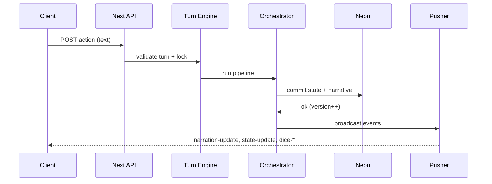
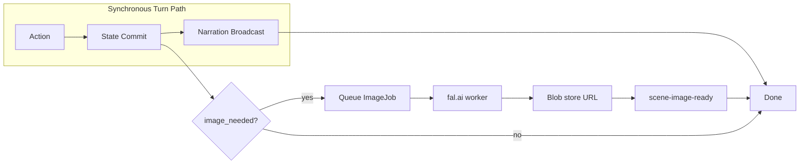

# ASHVEIL — Master Build Specification

**Version:** 1.0  
**Status:** Canonical — single source of truth for engineering and AI agents  
**Last updated:** 2026-03-24  

This document encodes every product, design, and technical decision for **Ashveil**. Any AI coding agent or human engineer MUST treat this file as authoritative when implementing features, resolving ambiguity, or reviewing architecture. When this spec conflicts with ad-hoc decisions, **this spec wins** unless explicitly revised here.

---

## Document map

| Part | Focus |
|------|--------|
| I | Product identity, modes, rules |
| II | Design system "Liquid Obsidian" |
| III | Screen-by-screen UX and behavior |
| IV | Stack, folders, data model, AI, realtime, images |
| V | Phased build plan with acceptance criteria |
| VI | Operations: failures, validation, cost, drift correction |
| VII | Instructions for Cursor / agent workflows |

---

# PART I: PRODUCT IDENTITY

## 1.1 Name and Tagline

- **Name:** Ashveil  
- **Tagline:** "A living world awaits"  
- **Product thesis:** Ashveil is a **mobile-first, browser-based multiplayer tabletop RPG engine** where **2–6 players** join via link, share the **same evolving game world in real time**, and play through an **AI-powered or human Dungeon Master**. Campaigns are **open-genre**: hosts set premise, tone tags, and optional world bible so fantasy, sci-fi, horror, modern, and hybrids are first-class. This is **not** a chat app with a single default setting — it is a **structured game engine** with **AI narrative orchestration** layered on top of **authoritative game state**. The AI narrates and interprets; it does not unilaterally rewrite truth.

**Positioning vs. adjacent products:**

- Unlike pure LLM chat RPGs, Ashveil has **turns**, **dice**, **validated state**, and **shared visibility**.
- Unlike VTT clones, Ashveil optimizes for **phone-first** sessions and **fast narrative loops**, not grid combat simulation.
- Unlike async play-by-post, Ashveil targets **synchronous or near-synchronous** table energy with clear **whose turn** semantics.

## 1.2 Core Promise

> "Open a link on your phone, join your friends, pick AI DM or Human DM, and play a seamless tabletop session in the genre you choose — the story evolves live, your dice matter, everyone sees the same action, and the world remains coherent."

**Success looks like:**

- A new player understands **mode** (AI vs human DM) and **join flow** in under one minute.
- During play, every player can answer: **whose turn**, **what just happened**, **what I can do** without hunting through chat history.
- Narration feels **cinematic but short**; mechanics feel **fair** because outcomes trace to **dice + rules**, not model whim.

## 1.3 Two Modes

### Mode A — AI Dungeon Master

- AI sets **mission framing**, **interprets** natural-language actions, **advances** story beats, **tracks** continuity via memory layers, **narrates** outcomes, and **updates** the shared scene description and (when triggered) **scene imagery**.
- The AI operates **inside** a deterministic pipeline: parse → rules → dice → state → narrate → optional image queue → broadcast.

### Mode B — Human Dungeon Master

- One designated user becomes **DM**.
- DM controls **mission progression**, **narration posts**, **scene transitions**, and may **override** or **inject** fiction consistent with (or explicitly changing) state via DM tools.
- DM may use **on-demand AI assist**: narration drafts, NPC dialogue suggestions, image prompt composition — each assist is **opt-in** and **reviewable** before affecting players.

**Shared requirement:** In both modes, **canonical state** lives in the database; **no client** and **no raw model output** is trusted as truth without validation.

## 1.4 Campaign Entry Options

1. **User-led prompt** — Host or table provides a seed (e.g. "noir harbor investigation", "generation-ship murder mystery", "bronze-age mythic voyage"). Campaign Seeder uses this as creative constraint and must not assume a default genre unless the seed implies it.
2. **AI-randomized journey** — Seeder invents premise, tone, and opening hook with variety controls (avoid repeating last N themes per session fingerprint where feasible).
3. **Structured module remix** — Pre-authored skeletons (e.g. haunted manor, prison break, crypt descent) supply **structure**; AI fills **details**, **NPCs**, and **branching** within module bounds.

**Design intent:** Option 3 supports **repeatable** onboarding demos and **content packs** later without rewriting the engine.

## 1.5 Non-Negotiable Product Rules

1. **Shared experience:** All players see the **same** state, actions, and outcomes on the feed and narrative surfaces (except where a mechanic explicitly requires **hidden** information — see privacy note below).
2. **Canonical state > AI output:** AI cannot mutate truth directly. All commits go through **validation** and **versioning**.
3. **Turn clarity:** It must **always** be obvious whose turn it is (player strip + action bar + round/turn chrome).
4. **Fast loop:** Target **Action → Dice → Result → Narrative** in **< 3s** excluding optional image generation (which is async).
5. **Short narration:** **Max ~120 words** in primary narrative card (pipeline allows 60–140 with validation; marketing cap ~120 for UX copy).
6. **Async images:** Image generation **never** blocks turn resolution or narration delivery.
7. **Mobile-first UX:** Thumb-friendly controls, low clutter, large touch targets, minimal horizontal cognitive load.
8. **No silos, no hidden turns:** Players do not "go private" for core combat/exploration turns unless a **published mechanic** says so (e.g. future stealth card mechanics). Default is **table transparency**.
9. **Reliability over uncontrolled openness:** Prefer **bounded** model behavior, **schemas**, **timeouts**, and **fallbacks** over unconstrained agent autonomy.
10. **Observability is mandatory:** From early phases, log and trace **turns**, **dice**, **state commits**, **AI steps**, **Pusher events**, and **image jobs** for debugging and cost attribution.

**Privacy note (future-safe):** If hidden information is introduced, it must be **explicit in rules**, **reflected in canonical state** (e.g. "hidden from player X"), and **enforced server-side** — never "DM pasted a secret in a private channel" as architecture.

---

# PART II: DESIGN SYSTEM — "LIQUID OBSIDIAN"

## 2.1 Design Philosophy

**Metaphor:** "We are not building a menu; we are crafting a magical artifact."

The UI should evoke **Diablo IV** meets **Elden Ring inventory** meets **Destiny** polish: **moody**, **premium**, **readable**, and **alive**. The product is **experience-first** — layout serves **emotion and clarity**, not arbitrary grid density.

The app should feel like **"a living table reacting to you"** — immediate, shared, tense when the fiction demands it — not **"a static RPG dashboard"**.

**Anti-patterns:**

- Dense stat dashboards on the main play surface.
- Bright white forms on black (harsh contrast without warmth).
- Generic "AI chat" bubbles as the primary game UI.
- Overuse of gold — gold is **meaning**, not **chrome**.

## 2.2 Color Palette

### 2.2.1 Base Colors

| Token | Hex | Usage |
|-------|-----|--------|
| Obsidian Black | `#0A0A0A` | Primary app background — **never** pure `#000000` (avoids OLED smear and dead flatness) |
| Midnight Surface | `#1A1A2E` | Cards, elevated surfaces |
| Deep Void | `#0F0F1A` | Secondary panels, recessed regions |

### 2.2.2 Gold Hierarchy (CRITICAL)

Gold must feel **legendary**, not **default**.

| Tier | Hex | Role |
|------|-----|------|
| Tier 1 — Rare / Interactive | `#D4AF37` | **Sparingly:** current player ring, primary CTA, active turn indicator, critical moments |
| Tier 2 — Support | `#B8860B` | Secondary icons, subtle highlights, hover states (desktop) |
| Tier 3 — Default | *None* | Most UI stays **dark**, **silver**, **muted**. Gold signals: **this matters right now** |

**Implementation rule:** If everything is gold, nothing is. Designers and engineers should default to **no gold** and add Tier 1 only where attention is required.

### 2.2.3 Adaptive Atmosphere Colors

UI **mood** shifts subtly with **game phase** (server-driven `phase` field). These are **ambient** — edge gradients, vignettes, soft overlays — not full theme swaps.

| Phase | Mood | Suggested accent |
|-------|------|------------------|
| Exploration | Cool teal / blue mist | `#1B4D6E` bleeding into edges |
| Combat | Deep ember-red glow | `#8B2500` from screen edges |
| Social / NPC | Warm amber undertone | harmonize with Tier 2 gold, not duplicate Tier 1 |
| Mystery / Magic | Deep violet / purple haze | `#7B2D8E` |
| Neutral / system | Pure obsidian | minimal highlights |

**Engineering note:** Atmosphere is **client-rendered** from **authoritative phase**; clients must not infer phase from narration text alone.

### 2.2.4 Functional Colors

| Role | Treatment |
|------|-----------|
| Health / Damage | Red gradient `#8B2500` → `#FF4444` |
| Mana / Essence | Blue gradient `#1B4D6E` → `#4488FF` |
| Success | Gold burst (short animation, not persistent fill) |
| Failure | Red dim (desaturate + reduce glow) |
| Critical | Purple + gold explosion (brief, celebratory) |
| Silver / Muted | `#C0C0C0` — secondary text, inactive states |

**Accessibility:** Never rely on color alone for outcomes; pair with **iconography**, **labels**, and **feed text**.

## 2.3 Typography

| Role | Font | Usage |
|------|------|--------|
| Serif headers (`.text-fantasy` in code) | **Noto Serif** (or equivalent high-quality serif) | Lore blocks, character names, scene titles, chapter labels. Major headers: uppercase + letter-spacing. Class name is historical; not a genre lock. |
| Gameplay text | **Manrope** | Actions, feed, descriptions — maximize readability at small sizes. |
| Data / stats | **Inter** | HP, dice, modifiers, timestamps — tabular clarity. |

**Loading strategy:** Self-host or `next/font` with **subset** weights to protect mobile performance. Avoid FOUT that flashes bright text — use `color: transparent` → fade-in pattern if needed.

**Scale (guideline):**

- Base body (mobile): 16px minimum for interactive readability.
- Feed entries: 14–15px with generous line-height.
- Scene title overlay: serif display, responsive clamp.

## 2.4 Surface System (Three Layers)

1. **Cold layer (background):** Minimal glow, recedes. Large voids, atmospheric gradients.
2. **Mid layer (cards):** Soft glass, subtle edge glow, `backdrop-blur`. Feed rows, narrative card, lobby panels.
3. **Hot layer (interactive):** Glow, gold accents, motion. Buttons, chips, active player, primary CTA.

**Contrast:** Maintain WCAG-aware contrast for **text on glass**; if blur reduces legibility, deepen scrim behind text.

## 2.5 Material: Glassmorphism

- `backdrop-blur` on layered surfaces.
- Inner shadow + **refractive** edge highlights on key cards (CSS pseudo-elements / layered borders).
- **Glow instead of hard borders** — avoid 1px harsh boxes; use soft outer glow for separation.
- Semi-transparent overlays on **scene imagery** for text legibility.
- Cards feel like **stacked glass panes**, not flat containers.

**Performance:** On low-end devices, degrade blur strength via `prefers-reduced-transparency` or FPS heuristics — never remove legibility.

## 2.6 Layout Principles

- **Thumb-first:** Primary actions in **bottom ~30%** of viewport on phone.
- **Void gaps:** Module rhythm is **Card → VOID → Card**, not stacked tight grids. Let background breathe.
- **No tab bar during active gameplay:** The **gameplay screen is the app**. Character, party, journal as **bottom sheets** over gameplay.
- **Floating bottom navigation** only outside sessions (home, lobby list if added later).
- **Cards float** — margin, elevation, glow — not cramped boxes.
- **One primary CTA per phase** — avoid competing gold buttons.

## 2.7 Animation and Motion

| Interaction | Motion spec |
|-------------|-------------|
| Page transitions | Fade + subtle slide, **200–300ms** |
| Bottom sheets | Spring physics, draggable handle, velocity snap |
| Feed entries | Slide up + opacity, **~150ms**, stagger **30–50ms** max (don't cascade long) |
| Narrative text | **Word-group rhythm** — not character typewriter. Chunk by phrase/clause for subtitle cadence |
| Scene image swap | **~800ms** crossfade + slight zoom |
| Turn change | Pulse / glow on active avatar |
| Dice | Tension hold **1–2s**, impact reveal |

**Principles:** Subtle, breathing, alive. **Selective** animation — respect battery and thermal limits on mobile browsers.

**Reduced motion:** Honor `prefers-reduced-motion`: replace springs with fades, shorten distances, disable parallax.

## 2.8 AI Presence Layer (Critical Differentiator)

The AI DM must feel **present**, not invisible.

- **Narrative panel:** Soft **pulsing glow** while AI pipeline is working (after action locked, before narration committed).
- **Thinking copy:** Muted micro-text: *"The world shifts…"*, *"Fate stirs…"* — rotate a small pool to avoid repetition fatigue.
- **Scene image:** Subtle **heat-distortion** shader or **slow breathing zoom** during AI thinking (cheap GPU path preferred).
- **Narrative reveal:** Text appears with **rhythm**, not instantly.
- **No spinners, no progress bars** for AI — organic metaphors only.
- **Typical duration:** **1–3s** for AI processing states (excluding provider incidents; failures use operational fallbacks).

**Engineering boundary:** "Thinking" UI maps to **known server events** (e.g. `action-submitted` → `narration-update`), not client-side timers guessing completion.

---

# PART III: SCREEN SPECIFICATIONS

## 3.1 Screen 1 — Home / Entry (Mode Select Portal)

**Feel:** Approaching a threshold into play — a **portal**, not a form.

### Layout

- Full-screen **atmospheric** background: slow fog, distant embers, faint rune particles (CSS + light canvas acceptable; avoid heavy video autoplay on mobile data).
- **Ashveil** centered, large **serif** with subtle **breathing glow** (opacity / blur pulse, 3–5s loop).
- Tagline: *"A living world awaits"*.
- Two large **glass cards** (mode selection):
  - **AI Dungeon Master** — purple + gold aura, sigil icon. Copy: *"An intelligent narrator guides your session"* (setting-agnostic).
  - **Human Dungeon Master** — calmer glow, shield icon. Copy: *"One player guides the fiction"* (setting-agnostic).
- Below: **[Create Session]** primary gold CTA, **[Join with Code]** secondary ghost button.
- Maximum breathing space; background visible through glass.

### Functionality mapping

- **Create Session** → server creates `Session` (`status: lobby`), generates **join code**, assigns **host**, stores `mode` (`ai_dm` | `human_dm`), redirects to **lobby**.
- **Join with Code** → validate code, create `Player` (or link user), redirect to **lobby**.
- **Invalid code:** inline error, shake animation on input, no toast spam.

### States

- Loading: CTA disabled, subtle gold shimmer along button edge (not spinner).
- Offline: ghost state + retry.

## 3.2 Screen 2 — Lobby / Gathering

**Feel:** Summoning allies around a **ritual circle**.

### Layout

- Atmospheric background, **center light** (fire pit / rune circle).
- **Session / adventure title** at top (default "Untitled Adventure" until seeded).
- **Player slots** in **arc or circle** — not a sterile vertical list. Empty slots: dim outline, *"Awaiting hero…"*. Filled: avatar, name, class, **Ready** glow.
- **AI DM presence** (Mode A): hooded silhouette or pulsing sigil — *"AI Dungeon Master — Ready when the table is"*.
- **Human DM** (Mode B): designated seat has **crown / shield** badge; host may assign DM before start.
- **Adventure config:** campaign entry option (prompt / random / module), optional prompt field, party size cap.
- **[Start Adventure]** gold CTA — **host only**, enabled when **all connected players ready** (configurable: allow start with min players if host confirms — default **all ready**).
- **[Share Invite]** copies link + displays code; uses OS share sheet on mobile where available.

### Realtime

- **Pusher presence** or equivalent events for join/leave/ready.
- New player: slot **illuminates** with short summon animation.

### Server fields

- Persist: `mode`, `campaign_mode`, `max_players`, `host_user_id`, `join_code`, optional `adventure_prompt`, `module_key`.

### Start flow

- **Start Adventure** triggers **Campaign Seeder** (AI heavy) — may take longer than 3s; lobby shows **ritual intensifies** atmosphere (not progress bar). On completion: `session-started` event, route to **character creation** or **gameplay** per phase gating (default: character creation if not complete).

## 3.3 Screen 3 — Character Creation

**Feel:** Forging identity at an **enchanted anvil** — quick but meaningful.

### Layout

- Portrait region at top — **silhouette** swaps by class/race selection (illustrative, not user-upload by default in v1).
- **Visual selectors** — horizontal icon rows with snap scroll; **no** native `<select>` for class/race.
- **Name** — single text field, validated for length and profanity filter (basic).
- **Stats** — server-generated; **Reroll** triggers dice animation; stats shown as **pills** in void gaps.
- **Equipment summary** — auto from class; small icons.
- **[Enter the World]** bottom CTA.

### Server authority

- Stats **rolled server-side** with logged seed for audit/debug.
- Client displays returned object; tampering rejected on submit.

### Completion

- Character persisted → player `is_ready` toggles → lobby or next gate per session flow.

## 3.4 Screen 4 — Main Gameplay (Core Screen)

**This is ~90% of the product.**

### Zone A — Scene Image (40–45% viewport)

- Edge-to-edge **scene art** (when ready); fallback stylized gradient + location title when no image.
- Subtle **parallax / slow zoom** (reduced-motion safe).
- **Scene title** bottom-left: e.g. *"Crypt of Embers"*.
- **Round + turn** top-right: *"Round 2 — Reza's Turn"*.
- **Updating:** shimmer overlay + *"Scene evolving…"* micro-text when `scene-image-pending`.

### Zone B — Narrative Card

- Glass card overlapping bottom of image.
- Small gold label: **NARRATIVE**.
- DM text, **word-group animation**, **≤ ~120 words** user-facing; ends with **clear next-player cue**.
- AI thinking: soft pulse + *"The tale unfolds…"* pool.

### Zone C — Action Feed

- Scrollable **capsules**: action, dice, state change, system.
- Icon + timestamp; **gold highlights** on critical terms (server may send `emphasis_spans` optional field in future; v1 can client-heuristic).
- Auto-scroll to latest; user scroll-up **pauses** auto-scroll until re-pin.

### Zone D — Player Strip

- Circular avatars, **gold ring** on current player; dim others; disconnected faded with **"…"**.
- **HP micro-bar** under avatar.
- Tap → **Character sheet** sheet.

### Zone E — Action Bar

- **Your turn:** placeholder *"What do you do?"*, chips **[Attack] [Spell] [Talk] [Inspect] [Move] [Item]**, **[Roll + Confirm]** gold CTA (exact flow: chips may pre-fill intent text).
- **Not your turn:** dim *"Watching [Player]'s turn…"* + **[Character ↑] [Party ↑] [Journal ↑]** sheet triggers.

### Event wiring (authoritative)

| Event | Client behavior |
|-------|-----------------|
| `turn-started` | Update strip, action bar, header chrome |
| `action-submitted` | Feed entry; lock input if yours |
| `dice-rolling` | Show dice overlay |
| `dice-result` | Overlay result; feed entry |
| `narration-update` | Animate narrative card |
| `state-update` | Merge canonical patches into store |
| `scene-image-pending` | Shimmer scene |
| `scene-image-ready` | Crossfade to image |

All via **Pusher** + **initial hydrate** from REST on load/reconnect.

## 3.5 Screen 5 — Dice Roll Overlay

**Feel:** Held breath → revelation.

- Full-screen scrim; gameplay blurred beneath (CSS `backdrop-filter`).
- Context label top: *"Stealth Check"*, *"Attack Roll"*, etc.
- Central dice: stylized **d20** default; gold edge, dark face; spin **1–2s**.
- Result slams: **`14 + 3 = 17`** large; color by outcome.
- Auto-dismiss **~2s**; persist in feed.

**Truth:** Server generates values; client animation is **presentation-only**. Never compute final outcome client-side.

## 3.6 Screen 6 — AI Thinking State

Not a route — a **state** of Screen 4.

- Distortion / breathing zoom on scene.
- Narrative card pulse + thinking copy.
- **1–3s typical**; if exceeded, still no spinner — escalate to subtle **runelight flicker** (still organic) and ensure traces capture slow steps.

## 3.7 Screen 7 — Character Sheet (Bottom Sheet)

**Feel:** Opening an adventurer's **journal**.

- Drag handle; spring motion.
- Portrait **bleeds** top edge slightly.
- Name, class, race, level.
- HP (red gradient) + Mana (blue) with numeric readout.
- Stat pills with void gaps.
- Conditions as chips.
- Inventory **floating grid**.
- Abilities scroll cards (name, description, cost).
- **Gold rare** — legendary items / active buffs only.

## 3.8 Screen 8 — Scene Transition (Cinematic)

- Full-screen takeover on **major** scene change.
- New image fades with **slow zoom**; narrative at bottom.
- **UI hidden 2–3s**, then fades back.
- Optional **location title card**: *"The Sunken Cathedral"*.

**Trigger list (authoritative):** DM button, AI narrator `visible_changes` containing `major_scene_change`, or module transition flags — server decides.

## 3.9 Screen 9 — Journal / Memory (Bottom Sheet)

**Feel:** Worn **leather journal**.

- Vertical timeline; icons + summary + timestamp.
- Important events: gold accent; normal: silver.
- **Pinned hooks** at top with **!** for active quests/leads.

**Data source:** Derived from `MemorySummary` + recent `NarrativeEvent` list (client read API); not a second chat log.

---

# PART IV: TECHNICAL ARCHITECTURE

## 4.1 Tech Stack (Locked)

| Layer | Choice |
|-------|--------|
| Frontend | **Next.js 15** (App Router) + **TypeScript** + **Tailwind CSS 4** + **Framer Motion** + **Zustand** |
| Database | **Neon Postgres** + **Drizzle ORM** |
| Cache / locks | **Upstash Redis** — turn locks, ephemeral keys, rate limits |
| Realtime | **Pusher Channels** — managed WebSockets, Vercel-friendly |
| Auth | **NextAuth.js** — session-based; invite links as primary onboarding |
| AI | **Provider-agnostic adapter** — OpenAI + Anthropic |
| Images | **fal.ai** (Flux family) — ~$0.03–0.04 / image (validate current pricing at build time) |
| Storage | **Vercel Blob** — scene images |
| Deploy | **Vercel** Pro — **60s** function timeout where needed |
| Testing | **Vitest** (unit) + **Playwright** (E2E) |

**Rationale snapshot:** Minimize ops surface (Neon, Upstash, Pusher, Vercel) while keeping **strong typing** and **fast mobile web**.

## 4.2 Folder Structure

```
/app
  /(marketing)        — landing page (future)
  /(game)
    /page.tsx          — home / entry
    /lobby/[code]/page.tsx
    /session/[id]/page.tsx
    /character/[sessionId]/page.tsx
/components
  /ui                  — design system primitives
  /game                — gameplay compositions
  /dice
  /scene
  /feed
  /character
  /lobby
/lib
  /db                  — Drizzle schema, connection, migrations
  /schemas             — Zod schemas for domain + AI I/O
  /state               — immutable canonical update helpers
  /orchestrator        — pipeline coordinator
  /ai                  — provider adapters
  /ai/workers          — intent, rules, narrator, summarizer, visual delta, prompt composer
  /rules               — dice, checks, validation
  /memory              — layer assembly, summarizer triggers
  /images              — fal client, job enqueue
  /socket              — Pusher helpers (server trigger + client subscribe)
  /debug               — trace helpers, redaction utilities
/server
  /services            — session, player, turn, dice, state, campaign
  /workers             — image queue consumer (if split from route handlers)
  /repositories        — DB access patterns
/tests
  /unit
  /integration
  /e2e
/public
  /fonts
  /images
```

**Convention:** No business logic hidden in React components — **call server actions / API routes** that delegate to `/server/services`.

## 4.3 System Architecture (Data Flow)

```
Client (Next.js)
   ⇄  Pusher (realtime)
   ⇄  Server (Route Handlers / Server Actions)
              ↓
        Turn Engine (deterministic)
              ↓
        AI Orchestrator (explicit steps)
         ↙   ↓   ↘
   Intent  Rules  Narrator
   Parser  Interp
              ↓
   State Validation + Commit
              ↓
   Neon Postgres (canonical truth)
              ↓
   Pusher broadcast (all clients)
```

**Reconnect path:** Client fetches `GET /api/sessions/:id/state` (snapshot + recent events) on mount and on reconnect; Pusher catches up live deltas.

## 4.4 Data Model (Core Entities)

Below: logical fields. Implement in Drizzle with appropriate types (`uuid`, `text`, `integer`, `boolean`, `timestamp`, `jsonb`).

### Session

| Field | Type | Notes |
|-------|------|--------|
| id | UUID | PK |
| mode | enum | `ai_dm` \| `human_dm` |
| campaign_mode | enum | `user_prompt` \| `random` \| `module` |
| status | enum | `lobby` \| `active` \| `paused` \| `ended` |
| max_players | int | 2–6 |
| current_round | int | default 1 |
| current_turn_index | int | circular index into ordered player list |
| current_player_id | UUID? | nullable if pause |
| phase | enum | `exploration` \| `combat` \| `social` \| `rest` |
| join_code | text | unique, short |
| host_user_id | text/UUID | NextAuth user id |
| state_version | int | optimistic concurrency |
| adventure_prompt | text? | user seed |
| module_key | text? | when module mode |
| campaign_title | text? | after seeding |
| created_at | timestamptz | |
| updated_at | timestamptz | |

**Indexes:** `join_code` unique; `host_user_id`; `status`.

### Player

| Field | Notes |
|-------|--------|
| id | PK |
| session_id | FK |
| user_id | NextAuth id |
| character_id | FK nullable until created |
| seat_index | 0–5 |
| is_ready | bool |
| is_connected | bool (heartbeat / presence) |
| is_host | bool |
| is_dm | bool |
| joined_at | timestamptz |

**Constraint:** At most one `is_dm = true` per session in human mode.

### Character

| Field | Notes |
|-------|--------|
| id | PK |
| player_id | FK unique |
| name | text |
| class | text / enum later |
| race | text / enum later |
| level | int default 1 |
| stats | jsonb `{ str,dex,con,int,wis,cha }` |
| hp, max_hp, ac | int |
| mana, max_mana | int |
| inventory | jsonb array |
| abilities | jsonb array |
| conditions | jsonb array |
| visual_profile | jsonb — art bible |
| created_at | timestamptz |

### Turn

| Field | Notes |
|-------|--------|
| id | PK |
| session_id | FK |
| round_number | int |
| player_id | FK |
| phase | enum |
| status | `awaiting_input` \| `processing` \| `resolved` |
| started_at, resolved_at | timestamptz |

### Action

| Field | Notes |
|-------|--------|
| id | PK |
| turn_id | FK |
| raw_input | text |
| parsed_intent | jsonb |
| resolution_status | `pending` \| `applied` \| `failed` |
| created_at | timestamptz |

### DiceRoll

| Field | Notes |
|-------|--------|
| id | PK |
| action_id | FK |
| roll_type | enum d4–d20 |
| context | text / enum — `attack_roll`, `stealth_check`, etc. |
| roll_value | int |
| modifier | int |
| total | int |
| advantage_state | `none` \| `advantage` \| `disadvantage` |
| result | `success` \| `failure` \| `critical_success` \| `critical_failure` |
| created_at | timestamptz |

### SceneSnapshot

| Field | Notes |
|-------|--------|
| id | PK |
| session_id | FK |
| round_number | int |
| state_version | int |
| summary | text |
| image_status | `none` \| `pending` \| `generating` \| `ready` \| `failed` |
| image_prompt | text? |
| image_url | text? |
| created_at | timestamptz |

### MemorySummary

| Field | Notes |
|-------|--------|
| id | PK |
| session_id | FK |
| summary_type | `rolling` \| `milestone` |
| content | jsonb — structured sections |
| turn_range_start / end | int |
| created_at | timestamptz |

### NarrativeEvent

| Field | Notes |
|-------|--------|
| id | PK |
| session_id | FK |
| turn_id | FK? |
| scene_text | text |
| visible_changes | jsonb array |
| tone | text |
| next_actor_id | UUID? |
| image_hint | jsonb |
| created_at | timestamptz |

### NPCState

| Field | Notes |
|-------|--------|
| id | PK |
| session_id | FK |
| name | text |
| role | text |
| attitude | text |
| status | `alive` \| `dead` \| `fled` \| `hidden` |
| location | text |
| visual_profile | jsonb |
| notes | text |
| updated_at | timestamptz |

### ImageJob

| Field | Notes |
|-------|--------|
| id | PK |
| session_id | FK |
| scene_snapshot_id | FK? |
| prompt | text |
| status | `queued` \| `processing` \| `ready` \| `failed` |
| provider | text — `fal` |
| image_url | text? |
| cost_cents | int? |
| started_at, completed_at | timestamptz |

### OrchestrationTrace

| Field | Notes |
|-------|--------|
| id | PK |
| session_id | FK |
| turn_id | FK? |
| step_name | text |
| input_summary | jsonb — redacted |
| output_summary | jsonb — redacted |
| model_used | text |
| tokens_in / tokens_out | int |
| latency_ms | int |
| success | bool |
| error_message | text? |
| created_at | timestamptz |

**Retention:** Traces can be large — plan pagination + TTL/archival for production cost control (implementation detail, not product).

## 4.5 AI Orchestration Pipeline

**Deterministic pipeline**, not free-roaming agent. Each step = **typed**, **validated**, **logged**, **fallback-ready**.

### Per-turn pipeline (ordered)

```
1. Player submits action text
2. Intent Parser (AI, light/heavy by complexity)
   → ActionIntent + confidence
   → Zod validate; fallback: rephrase request
3. Rules Interpreter (AI light)
   → required rolls, modifiers, legality
   → Zod validate; fallback: simple d20 check
4. Dice Service (deterministic)
   → DiceRoll row(s)
5. State Delta Proposal (deterministic)
   → proposed patches
6. State Validation + Commit (deterministic)
   → version check → commit or reject
7. Memory Update (AI light, cadence 3–5 turns)
   → rolling summary; fallback: skip, use raw window
8. Narrator (AI heavy)
   → { scene_text, visible_changes, tone, next_actor, image_hint }
   → Zod + word count 60–140; fallback template
9. Visual Delta Check (AI light, cadence ≤ once/round)
   → { image_needed, reasons[] }
10. If image_needed: Image Prompt Composer (AI light)
    → { prompt, style_key, composition_hint }
    → enqueue ImageJob (async)
11. Broadcast via Pusher
```

### Campaign Seeder (once per session start)

- **Input:** `campaign_mode`, optional `adventure_prompt`, `module_key`, party composition/size.
- **Output:** `campaign_title`, `world_summary`, `opening_mission`, `objective`, `first_scene`, initial `NPCState` seeds, `initial_threat`, `tone`, `style_policy`, initial `visual_bible` fragment.
- **Model:** HEAVY.
- **Persistence:** Write to `Session` + related tables; emit `session-started`.

## 4.6 AI Model Routing

| Task | Tier | Recommended | Est. cost / call (indicative) |
|------|------|-------------|-------------------------------|
| Campaign seeding | HEAVY | GPT-4o-class | ~$0.02 |
| Narration | HEAVY | GPT-4o-class | ~$0.006 |
| NPC/world reaction | HEAVY | GPT-4o-class | ~$0.008 |
| Memory compression | HEAVY | GPT-4o-class | ~$0.005 |
| Complex intent | HEAVY | GPT-4o-class | ~$0.004 |
| Simple intent | LIGHT | GPT-4o-mini-class | ~$0.0005 |
| Rules interpretation | LIGHT | mini | ~$0.0005 |
| Visual delta | LIGHT | mini | ~$0.0004 |
| Image prompt compose | LIGHT | mini | ~$0.0005 |
| Dice / turn / state | NONE | code | $0 |

**Estimated** full **4-player, 60-turn** session: **~$0.86** — re-benchmark with live token counts and current pricing.

**Routing rules:**

- Start LIGHT for intent; escalate to HEAVY if confidence low or heuristics detect multi-target / complex phrasing.
- Narration always HEAVY unless emergency fallback template invoked.

## 4.7 AI Provider Adapter

```typescript
interface AIProvider {
  generateStructured<T>(params: {
    model: 'heavy' | 'light';
    systemPrompt: string;
    userPrompt: string;
    schema: ZodSchema<T>;
    maxTokens?: number;
    temperature?: number;
  }): Promise<{ data: T; usage: TokenUsage }>;

  generateText(params: {
    model: 'heavy' | 'light';
    systemPrompt: string;
    userPrompt: string;
    maxTokens?: number;
    temperature?: number;
  }): Promise<{ text: string; usage: TokenUsage }>;
}
```

**Implementations:** `OpenAIProvider`, `AnthropicProvider`, `MockProvider` (tests).

**Cross-cutting:** timeouts, retries (idempotent reads only), JSON repair on parse failure **once**, then fallback.

## 4.8 Memory System (Five Layers)

| Layer | Name | Role |
|-------|------|------|
| A | Canonical state | DB truth — HP, conditions, initiative, inventory, NPCs, objectives |
| B | Recent event window | Last 1–2 rounds raw — immediate continuity |
| C | Rolling summary | Compressed every 3–5 turns — hooks, relationships, mission progress |
| D | Style / policy | Static prompt constitution — brevity, next actor, no uncommitted inventions |
| E | Visual bible | Art consistency — palettes, motifs, character/NPC visual anchors |

**Assembler:** `buildMemoryBundle(workerName, sessionId, turnId)` returns **minimal necessary** context to cap tokens.

## 4.9 Real-time Event System (Pusher)

**Channel:** `session-{sessionId}`  
**Auth:** Private channel; server authorizes membership via session + user.

**Events (payloads illustrative — finalize in Zod):**

- `player-joined` `{ player_id, name, character_class }`
- `player-ready` `{ player_id, is_ready }`
- `player-disconnected` `{ player_id }`
- `session-started` `{ campaign_title, opening_scene }`
- `turn-started` `{ turn_id, player_id, round_number }`
- `action-submitted` `{ player_id, raw_input }`
- `dice-rolling` `{ roll_context, dice_type }`
- `dice-result` `{ dice_type, roll_value, modifier, total, result }`
- `narration-update` `{ scene_text, visible_changes, next_actor }`
- `state-update` `{ changes[], state_version }`
- `scene-image-pending` `{ scene_id, label }`
- `scene-image-ready` `{ scene_id, image_url }`
- `round-summary` `{ summary_text, round_number }`

**Ordering:** Clients must not assume total order across event types — always apply `state_version` monotonic rules and server snapshot on mismatch.

## 4.10 Image Generation Pipeline

**Trigger:** Visual delta returns `image_needed: true` — **at most once per round** under normal rules.

**Flow:**

1. Round completes (or phase transition — product-defined hook).
2. Visual delta evaluator compares previous `SceneSnapshot` vs current canonical state.
3. If needed: insert `SceneSnapshot` + `ImageJob`.
4. Image Prompt Composer builds prompt from **canonical** state + **visual bible**.
5. Enqueue fal job **async**.
6. `scene-image-pending` broadcast.
7. Gameplay continues — narration already delivered.
8. On completion: store Blob URL, mark job ready, `scene-image-ready`.
9. Client crossfade.

**Generate when:** new location, combat start/phase change, major environmental change, boss/reveal, mission success/failure tableau.

**Skip when:** minor HP tick, trivial item use, non-visual numeric change.

**Failure:** Keep previous image; log; optional toast *"Visions blurred — the scene holds"* (copy optional, subtle).

---

# PART V: BUILD PHASES

## Phase 0 — Repo Scaffold

**Cursor complexity:** LOW (fast agent)  
**Goal:** Runnable Next.js skeleton + design tokens + placeholders.

**Tasks:**

- Init Next.js 15 + TS + Tailwind 4.
- Create folder tree per §4.2.
- Strict `tsconfig` (`strict`, `noUncheckedIndexedAccess` recommended).
- `.env.example`: `OPENAI_API_KEY`, `ANTHROPIC_API_KEY`, `DATABASE_URL`, `PUSHER_APP_ID`, `PUSHER_KEY`, `PUSHER_SECRET`, `PUSHER_CLUSTER`, `NEXT_PUBLIC_PUSHER_KEY`, `NEXT_PUBLIC_PUSHER_CLUSTER`, `FAL_KEY`, `BLOB_READ_WRITE_TOKEN`, `NEXTAUTH_SECRET`, `NEXTAUTH_URL`, `UPSTASH_REDIS_REST_URL`, `UPSTASH_REDIS_REST_TOKEN`.
- Deps: `framer-motion`, `zustand`, `zod`, `drizzle-orm`, `@neondatabase/serverless`, `pusher`, `pusher-js`, `next-auth`, `@auth/drizzle-adapter` (if used), testing libs.
- `globals.css` — CSS variables for palette, typography, radii, blur strengths.
- Placeholder routes for all pages.
- Base components: `GlassCard`, `GoldButton`, `GhostButton`.

**Acceptance:** `pnpm dev` / `npm run dev` runs; folders exist; tokens defined; buttons render with glass/gold styles.

## Phase 1 — Domain Schemas

**Cursor complexity:** MEDIUM  
**Goal:** Every entity and AI I/O typed via Zod.

**Tasks:**

- Zod schemas for §4.4 tables + DTOs for API payloads.
- Enums for modes, phases, statuses.
- `state_version` on mutable aggregates.
- Fixture factories for tests.
- Immutable update helpers for canonical merges.

**Acceptance:** Single import path for types; test fixtures build without manual casts everywhere.

## Phase 2 — Database + Drizzle

**Cursor complexity:** MEDIUM  
**Goal:** Neon schema + migrations + repositories.

**Tasks:**

- Drizzle config with Neon serverless.
- Tables matching §4.4.
- Initial migration + `db:push` / `db:migrate` scripts.
- Repository functions with typed results.
- Dev seed script (optional session + players).

**Acceptance:** Integration test connects and CRUDs a session.

## Phase 3 — Session + Lobby

**Cursor complexity:** MEDIUM  
**Goal:** Create/join + lobby UI + realtime presence.

**Tasks:**

- Session service: create, join, get, update config.
- Join code generator (readable, exclude ambiguous chars).
- Screens 1–2 implementation.
- Pusher presence for lobby.
- Ready toggles.

**Acceptance:** Two browsers see each other join/ready in <1s typical latency.

## Phase 4 — Character Creation

**Cursor complexity:** LOW  
**Goal:** Character flow end-to-end to DB.

**Tasks:**

- Screen 3 UI.
- Server-side stat roll endpoint.
- Persist character, link to player.
- Ready gating.

**Acceptance:** Fresh player can create character; host sees ready state.

## Phase 5 — Real-time Session Shell

**Cursor complexity:** MEDIUM  
**Goal:** Gameplay layout + subscription + store hydrate.

**Tasks:**

- Screen 4 zones with placeholders.
- Zustand store: session, players, turn, feed arrays.
- Pusher subscribe + event reducers.
- Player strip + basic connection indicator.

**Acceptance:** Multiple clients show same placeholder state updates when events mocked or manually triggered.

## Phase 6 — Turn Engine + Dice

**Cursor complexity:** HIGH  
**Goal:** Bulletproof turn order + authoritative dice.

**Tasks:**

- Turn service: advance, ownership checks, round increments.
- Redis lock per `sessionId` during processing.
- Dice service: advantage/disadvantage, crit rules as product defines (document in `/lib/rules`).
- Versioned state commits.
- Screen 5 overlay.
- Vitest coverage for concurrency + illegal turns.

**Acceptance:** Fuzz tests show no double-submit wins; wrong player cannot act.

## Phase 7 — Action Feed + Turn Visibility

**Cursor complexity:** MEDIUM  
**Goal:** Shared table feeling.

**Tasks:**

- Typed feed entries; reducers append from events.
- Action bar states; chips insert text.
- Inactive waiting UI.

**Acceptance:** Demo script: 4 synthetic events render identically on N clients.

## Phase 8 — AI Orchestration Harness

**Cursor complexity:** HIGH  
**Goal:** Modular orchestrator + providers + traces.

**Tasks:**

- Implement §4.7 + routing §4.6.
- Pipeline skeleton executing mock steps.
- `OrchestrationTrace` rows per step.
- Retry/timeout policy table (align §6.1).

**Acceptance:** Single API call runs pipeline with MockProvider deterministically.

## Phase 9 — Memory System

**Cursor complexity:** HIGH  
**Goal:** Layer assembly + rolling summaries.

**Tasks:**

- Implement §4.8 helpers.
- Summarizer worker + cadence gate.
- Tests that key facts survive compression (golden prompts).

**Acceptance:** Simulated 10-turn run produces coherent summary JSON.

## Phase 10 — AI DM Narrative Loop

**Cursor complexity:** HIGH  
**Goal:** End-to-end AI DM turn.

**Tasks:**

- Workers: intent, rules, narrator with Zod + word count enforcement.
- Campaign seeder on start.
- Wire broadcast sequence.
- Screen 6 thinking UI tied to events.
- Narrative word-group animation.

**Acceptance:** Playable vertical slice on mobile web: submit action → dice → narration ≤ product targets when provider healthy.

## Phase 11 — Scene Image Pipeline

**Cursor complexity:** MEDIUM  
**Goal:** Async art with UI polish.

**Tasks:**

- Visual delta + prompt composer.
- fal client + Blob upload path.
- ImageJob processor (route cron or queue worker pattern suitable for Vercel).
- Screen 8 transitions + shimmer.

**Acceptance:** Images arrive late without blocking; crossfade smooth; failed jobs benign.

## Phase 12 — Human DM Mode

**Cursor complexity:** MEDIUM  
**Goal:** DM controls + assists.

**Tasks:**

- DM role assignment.
- DM panel: post narration, advance scene, overrides (with audit log optional).
- AI assist buttons calling same workers with DM-only auth.

**Acceptance:** Human DM can run session without AI narration; assists optional.

## Phase 13 — Mobile UX Polish

**Cursor complexity:** MEDIUM  
**Goal:** Premium feel.

**Tasks:**

- Thumb zone audit; touch targets ≥44px.
- Atmosphere by phase §2.2.3.
- Motion polish + reduced-motion QA.

**Acceptance:** Design review checklist passes on iOS Safari + Chrome Android.

## Phase 14 — Debug, Testing, Hardening

**Cursor complexity:** HIGH  
**Goal:** Production-safe.

**Tasks:**

- Debug panel: state, traces, memory, image status (dev-only flag).
- Structured logging.
- Playwright happy paths + Vitest rules.
- Reconnect + stale session recovery.
- Rate limits + cost dashboards (basic).

**Acceptance:** Long soak simulation stable; on-call can diagnose from traces alone.

**Phase dependency graph (simplified):** 0 → 1 → 2 → 3 → 4 → 5 → 6 → 7 → 8 → (9 ∥ 10 wiring) → 10 → 11 → 12 → 13 → 14.

---

# PART VI: OPERATIONAL RULES

## 6.1 Failure Modes and Fallbacks

| Failure | Fallback |
|---------|----------|
| Intent parser fails | Ask player to rephrase |
| Rules interpreter fails | Default simple d20 ability check |
| Narrator fails | Template: "[Player] [action]. [Result]. [Next player], your turn." |
| Memory summarizer fails | Skip update; use raw recent turns |
| Visual delta fails | Skip image this round |
| Image generation fails | Keep old image; log; continue |
| Pusher disconnect | Reconnect + snapshot hydrate |
| DB write fails | Retry once; then pause turn + alert players |
| AI timeout (>10s) | Retry lighter model; then template narration |

## 6.2 Validation Rules

- All AI outputs **Zod-validated** before use.
- Narrator word count **60–140**; retry once with tighten prompt; then template.
- State deltas validated against rules engine.
- Turn ownership + `state_version` mandatory on writes.

## 6.3 Cost Controls

- Prefer LIGHT models; HEAVY only where §4.6 says.
- Max **1** image / round unless DM override (logged).
- Log tokens per `OrchestrationTrace`.
- Per-session rolling cost estimate (admin only).
- Rate limit **2 AI calls / second / session** (burst smoothing).

## 6.4 Non-Negotiable Architectural Rules

1. Canonical structured state is truth.  
2. AI never directly commits state — deterministic validation always.  
3. Turn flow enforced server-side.  
4. Narration concise and structured.  
5. Shared feed and consequences.  
6. Images async / non-blocking.  
7. Image prompts from approved state + bible, not raw chat.  
8. Mobile-first.  
9. Schema validation always.  
10. Trace every orchestration step.

## 6.5 Drift Correction Prompts

**Architecture drift:**  
> Stop and re-evaluate against `ASHVEIL_SPEC.md` Part IV. List where code drifts from: canonical state authority, shared visibility, AI overreach, narration length, async images, mobile-first UX. Propose smallest safe correction.

**UX drift:**  
> Review session UI as a phone player. Can I tell whose turn it is? Can I see what happened? Can I act quickly? Does it feel shared? Is text concise? Fix the smallest changes needed.

**AI drift:**  
> Audit AI orchestration. Find any place AI is trusted too much or schema validation is missing. Fix while preserving DM experience. Remember: AI proposes, canonical state decides.

## 6.6 Security and Abuse (Baseline)

- Validate session membership on every API and Pusher auth.
- Rate-limit joins and AI calls per IP/session.
- Sanitize user text before echo to feed (XSS prevention — React default escaping + no `dangerouslySetInnerHTML` for player content).
- Never expose provider API keys to client bundles.
- Log redaction for PII in traces (`input_summary` / `output_summary`).

## 6.7 Observability Checklist

- Structured JSON logs in serverless functions.
- Correlation ID per `turn_id` threading through logs + traces.
- Dashboards later: AI cost, error rate, Pusher disconnect rate, image failure rate.

---

# PART VII: CURSOR AGENT INSTRUCTIONS

## 7.1 How to Use This Spec

1. Read **this file** before starting any phase.  
2. Implement **one phase** at a time unless explicitly unblocked.  
3. After each phase: **summarize** deliverables, **list files touched**, **note gaps**.  
4. Do **not** attempt the entire app in one pass.

## 7.2 Cursor Behavior Rules

- Prefer **correctness** over speed.  
- Preserve **working** code; avoid unnecessary rewrites.  
- **Strict TypeScript** everywhere.  
- **Schemas before features.**  
- **Tests** for turn engine, dice, state transitions, and AI boundary adapters.  
- Inline comments only for **non-obvious invariants** — avoid noise.  
- Do not add unapproved external services.  
- Do not replace architecture without explicit spec update.

## 7.3 Model Routing for Cursor Tasks

| Phase groups | Suggested Cursor model tier |
|--------------|----------------------------|
| HIGH (6, 8, 9, 10, 14) | Stronger / reasoning-capable |
| MEDIUM (1, 2, 3, 5, 7, 11, 12, 13) | Default balanced |
| LOW (0, 4) | Fast / smaller |

---

## Appendix A — Glossary

| Term | Definition |
|------|------------|
| Canonical state | Database-backed, versioned game truth |
| Orchestrator | Code-owned pipeline invoking AI steps |
| Visual bible | Structured art direction for consistency |
| Scene snapshot | Point-in-time description + optional image metadata |
| Turn lock | Redis mutex preventing concurrent turn processing |

## Appendix B — Example API Shapes (Non-Normative)

`POST /api/sessions` → `{ sessionId, joinCode }`  
`POST /api/sessions/:id/join` → `{ playerId }`  
`POST /api/sessions/:id/actions` → `{ turnId, text }` — returns `202` + processing accepted, final via Pusher.

Finalize contracts in `/lib/schemas` during Phase 1.

## Appendix C — Narration Fallback Template

```
{playerName} attempts {shortActionSummary}. {outcomeSentence} {nextPlayerName}, your turn.
```

Keep under 60 words if primary narrator fails twice.

---

## Appendix D — Turn and Session State Machine (Normative Behavior)

### D.1 Session status transitions

```
lobby → active   (host starts adventure; seeder completes successfully)
active → paused  (DM or host pause — future; v1 may omit)
active → ended   (explicit end session or timeout policy)
paused → active  (resume)
```

**Lobby constraints:** While `status = lobby`, no turn engine runs except test hooks. Character creation may complete; `Session.state_version` increments only when entering gameplay setup that mutates canonical state.

### D.2 Turn lifecycle

```
awaiting_input → processing → resolved
```

- **`awaiting_input`:** Exactly one `Turn` row per session should be "current" (define `current_turn_id` on session or infer from latest non-resolved turn — implementation chooses one pattern; document in code).
- **`processing`:** Turn lock held in Redis; action submission idempotent by `action_id` or client request id.
- **`resolved`:** Narration committed, state version bumped, next turn created or round advanced.

**Illegal states:** Two concurrent `processing` turns for same session must be impossible (lock + DB constraint).

### D.3 Player action submission flow (server)

1. Authenticate user → resolve `Player` for `session_id`.  
2. Verify `session.status === active`.  
3. Verify `Turn.player_id === player.id` and `Turn.status === awaiting_input`.  
4. Acquire Redis lock `turn:{sessionId}` with TTL (e.g. 45s) extendable during long AI calls — prefer splitting AI into async jobs only where spec allows; v1 may hold lock through short pipeline with timeout safeguards.  
5. Insert `Action` with `resolution_status = pending`.  
6. Run orchestrator steps 2–11 (§4.5).  
7. On success: mark action `applied`, turn `resolved`, create next turn, release lock.  
8. On recoverable failure: release lock, return structured error to client, leave turn `awaiting_input` if no partial commits occurred.  
9. On partial commit disaster: **must not happen** — use single DB transaction wrapping state commit + narrative insert where feasible, or saga with compensating transactions (document chosen approach in `/server/services`).

### D.4 Reconnection and stale clients

- On WebSocket reconnect, client **must** call snapshot hydrate before trusting local Zustand state.  
- If local `state_version` < server `state_version`, discard pending optimistic UI.  
- Show non-blocking banner: *"Catching up with the table…"* only if hydrate exceeds 500ms.

---

## Appendix E — Human DM Mode: Authority Matrix

| Capability | AI DM mode | Human DM mode |
|------------|------------|---------------|
| Who writes primary narration? | Narrator worker | Human DM (typed or pasted) |
| Who advances turn? | Engine after pipeline | DM confirms advance (or auto-advance policy configurable) |
| Who triggers dice? | Rules interpreter + player confirm | DM may request roll; player still rolls for own character where applicable |
| Who edits NPC HP? | State delta from rules | DM override panel (audited) |
| AI assist | Continuous pipeline | On-demand buttons only |
| Image generation | Automatic per §4.10 | DM can trigger + preview prompt |

**Rule:** Human DM **cannot** bypass turn ownership for player actions without an explicit **override** action logged in `OrchestrationTrace` or `NarrativeEvent` metadata (implementation: `dm_override: true` flag on state patch).

---

## Appendix F — Pusher Authorization Contract (Sketch)

**Endpoint:** `POST /api/pusher/auth` (Next.js route).

**Inputs:** `socket_id`, `channel_name` (must match `private-session-*` pattern).

**Validation:**

1. User session from NextAuth.  
2. Parse `sessionId` from channel name.  
3. Verify `Player` row exists for (`user_id`, `session_id`).  
4. Return Pusher auth signature JSON.

**Never** authorize channels for arbitrary session IDs without membership check.

---

## Appendix G — Canonical State Patch Format (Illustrative)

Use a discriminated union in Zod, e.g.:

```typescript
// Illustrative only — finalize in Phase 1
type StatePatch =
  | { op: 'npc_hp'; npcId: string; delta: number; reason: string }
  | { op: 'player_hp'; playerId: string; delta: number }
  | { op: 'condition_add'; targetId: string; condition: string }
  | { op: 'condition_remove'; targetId: string; condition: string }
  | { op: 'inventory_add'; playerId: string; item: ItemRef }
  | { op: 'phase_set'; phase: GamePhase }
  | { op: 'location_set'; summary: string; tags: string[] };
```

Patches are **proposed** by deterministic layer, **validated**, then **committed** as a single version bump.

---

## Appendix H — Testing Strategy (Expanded)

### H.1 Unit tests (Vitest)

- Dice: bounds, advantage/disadvantage selection, crit edge cases.  
- State validation: reject negative HP, over-cap mana, wrong target ids.  
- Zod schemas: fixtures round-trip encode/decode.  
- Memory bundle: token budget caps, required keys per worker.

### H.2 Integration tests

- Session create + join + duplicate seat prevention.  
- Turn lock: concurrent `POST /actions` from same player only one succeeds; other gets `409` or typed error.  
- Pusher: mock server or contract tests verifying event payload shapes.

### H.3 E2E tests (Playwright)

- Two contexts: host creates, guest joins, both see lobby ready states.  
- Forthcoming: full vertical slice when Phase 10 lands — single scripted turn with MockProvider on server test mode.

### H.4 Long-run simulation

- Script 30–60 synthetic turns with MockProvider deterministic outputs; assert monotonic `state_version`, no stuck `processing` turns, memory summarizer cadence respected.

---

## Appendix I — Performance Budgets (Mobile Web)

| Metric | Target |
|--------|--------|
| First interactive on session page (LTE) | < 3s on mid device (best effort) |
| Time to narration after action (provider healthy, no image) | < 3s |
| Dice overlay total dwell | 2–4s inclusive animation |
| JS bundle for gameplay route | Monitor; code-split `framer-motion` and heavy panels |
| Pusher event→paint | < 100ms typical client processing |

**Scene images:** Loaded lazily; placeholder always instant.

---

## Appendix J — Content, Safety, and Moderation (Baseline Policy)

- **Player names and actions:** Basic profanity filter optional; log-only mode for early betas.  
- **AI outputs:** System prompts include: no graphic sexual content, no real-person harm, no instructions for wrongdoing. Refusals should narrate *fade-to-black* or *"The tale turns aside…"* without breaking turn flow.  
- **Image prompts:** Additional safety pass — strip PII-like strings; avoid celebrity names; use fictional descriptors only.  
- **Reporting:** Future: flag narration line to host (human DM mode first).

This is **not** a legal document — product owner must align with counsel for production.

---

## Appendix K — Mermaid: Turn Pipeline (Reference)



---

## Appendix L — Mermaid: Image Async Path (Reference)



---

## Appendix M — Expanded Phase Notes (Risks & Dependencies)

### Phase 0 risks

- Tailwind 4 config drift vs tutorials — pin versions in lockfile.  
- Font licensing — confirm Noto/Manrope/Inter licenses for web embedding.

### Phase 1 risks

- Over-normalizing JSON in Zod — prefer pragmatic schemas matching DB jsonb.

### Phase 2 risks

- Neon cold start — use pooler connection string; document in README internal.

### Phase 3 risks

- Pusher channel naming typos — centralize in `/lib/socket/channels.ts`.

### Phase 4 risks

- Client-side stat tampering — always validate server response only, never trust client rolls.

### Phase 5 risks

- Zustand over-globalization — slice stores: `sessionStore`, `uiStore`, `feedStore` optional fusion later.

### Phase 6 risks

- Redis unavailability — degrade gracefully: fail closed (reject action) rather than double-process; surface *"Table locked — retry"* copy.

### Phase 7 risks

- Feed spam with rapid system events — coalesce micro-updates server-side if needed.

### Phase 8 risks

- Provider JSON schema drift — strict Zod + repair once + fallback.

### Phase 9 risks

- Summary hallucination — keep structured JSON summary sections, not freeform only.

### Phase 10 risks

- Latency spikes — show thinking UI tied to real events, not fake timers.

### Phase 11 risks

- fal webhook vs polling — choose one pattern and document; secure webhook signature if used.

### Phase 12 risks

- DM abuse of overrides — audit log + future moderation.

### Phase 13 risks

- Animation jank on low-end Android — test on real devices.

### Phase 14 risks

- Log volume cost — sample traces in production.

---

## Appendix N — Copy Deck (Key Strings)

| Location | String |
|----------|--------|
| Home tagline | A living world awaits |
| Thinking pool | The world shifts… / Fate stirs… / The tale unfolds… |
| Scene pending | Scene evolving… |
| Dice context fallback | Fortune rolls… |
| Reconnect | Catching up with the table… |
| Image failure soft | The vision falters; the scene remains. |

Maintain in `/lib/copy/ashveil.ts` for i18n readiness later.

---

## Appendix O — Future Features (Explicitly Out of Scope for v1)

- Voice chat integration.  
- User-upload character portraits with moderation pipeline.  
- Full tactical grid combat.  
- Homebrew rules engine plugins.  
- Native mobile wrappers (Capacitor / React Native) — web-first until proven.

Record new scope decisions by **editing this spec**, not scattered ADRs, unless team policy changes.

---

## Appendix P — Design Tokens: Recommended CSS Custom Properties

Define in `globals.css` (names illustrative):

```css
:root {
  /* Base */
  --color-obsidian: #0a0a0a;
  --color-midnight: #1a1a2e;
  --color-deep-void: #0f0f1a;

  /* Gold hierarchy */
  --color-gold-rare: #d4af37;
  --color-gold-support: #b8860b;

  /* Atmosphere */
  --atmosphere-exploration: #1b4d6e;
  --atmosphere-combat: #8b2500;
  --atmosphere-mystery: #7b2d8e;

  /* Functional */
  --color-silver-muted: #c0c0c0;
  --gradient-hp-start: #8b2500;
  --gradient-hp-end: #ff4444;
  --gradient-mana-start: #1b4d6e;
  --gradient-mana-end: #4488ff;

  /* Glass */
  --glass-bg: rgba(26, 26, 46, 0.55);
  --glass-blur: 16px;
  --glass-edge-glow: 0 0 24px rgba(212, 175, 55, 0.12);

  /* Typography stacks */
  --font-fantasy: "Noto Serif", ui-serif, Georgia, serif;
  --font-gameplay: "Manrope", ui-sans-serif, system-ui, sans-serif;
  --font-data: "Inter", ui-monospace, system-ui, sans-serif;

  /* Motion */
  --duration-fast: 200ms;
  --duration-med: 300ms;
  --ease-out-soft: cubic-bezier(0.22, 1, 0.36, 1);
}
```

Map Tailwind theme extensions to these variables in Phase 0 for a single source in CSS.

---

## Appendix Q — Redis Key Conventions

| Key pattern | Purpose | TTL |
|-------------|---------|-----|
| `turn:lock:{sessionId}` | Exclusive turn processing | 45s default, extend carefully |
| `ratelimit:ai:{sessionId}` | Token bucket for AI calls | sliding window |
| `ratelimit:join:{ip}` | Join endpoint protection | 1 min |
| `presence:lobby:{sessionId}` | Optional cache of last lobby heartbeat | short |

**Never** store canonical game state only in Redis — Postgres remains truth.

---

## Appendix R — Worker I/O Shapes (Illustrative Zod-Style Definitions)

Finalize in `/lib/schemas` in Phase 1; below guides intent.

### R.1 ActionIntent (Intent Parser output)

```typescript
// Illustrative — names and fields may be refined
const ActionIntent = z.object({
  action_type: z.enum([
    'attack',
    'cast_spell',
    'move',
    'talk',
    'inspect',
    'use_item',
    'other',
  ]),
  targets: z.array(z.object({ kind: z.enum(['npc', 'player', 'environment']), id: z.string().optional(), label: z.string().optional() })).default([]),
  skill_or_save: z.enum(['str', 'dex', 'con', 'int', 'wis', 'cha', 'none']).default('none'),
  requires_roll: z.boolean(),
  suggested_roll_context: z.string().optional(),
  confidence: z.number().min(0).max(1),
  rephrase_reason: z.string().optional(),
});
```

### R.2 RulesInterpreterOutput

```typescript
const RulesInterpreterOutput = z.object({
  legal: z.boolean(),
  denial_reason: z.string().optional(),
  rolls: z.array(
    z.object({
      dice: z.enum(['d4', 'd6', 'd8', 'd10', 'd12', 'd20']),
      modifier: z.number(),
      advantage_state: z.enum(['none', 'advantage', 'disadvantage']),
      context: z.string(),
    }),
  ),
  auto_success: z.boolean().optional(),
});
```

### R.3 NarratorOutput

```typescript
const NarratorOutput = z.object({
  scene_text: z.string().min(20).max(4000), // raw max; enforce 60-140 words in secondary check
  visible_changes: z.array(z.string()),
  tone: z.string(),
  next_actor_id: z.string().uuid().nullable(),
  image_hint: z.object({
    subjects: z.array(z.string()).default([]),
    environment: z.string().optional(),
    mood: z.string().optional(),
    avoid: z.array(z.string()).default([]),
  }),
});
```

**Word count:** Split `scene_text` on whitespace; if count `< 60` or `> 140`, retry narration once with tightening instructions; then template fallback.

### R.4 VisualDeltaOutput

```typescript
const VisualDeltaOutput = z.object({
  image_needed: z.boolean(),
  reasons: z.array(z.string()),
  priority: z.enum(['low', 'normal', 'high']).default('normal'),
});
```

### R.5 CampaignSeedOutput (Campaign Seeder)

```typescript
const CampaignSeedOutput = z.object({
  campaign_title: z.string(),
  world_summary: z.string(),
  opening_mission: z.string(),
  objective: z.string(),
  first_scene: z.object({
    title: z.string(),
    description: z.string(),
    sensory_tags: z.array(z.string()).default([]),
  }),
  initial_npcs: z.array(
    z.object({
      name: z.string(),
      role: z.string(),
      attitude: z.string(),
      hook: z.string().optional(),
      visual_profile: z.record(z.unknown()).optional(),
    }),
  ),
  initial_threat: z.string().optional(),
  tone: z.string(),
  style_policy: z.string(),
  visual_bible_seed: z.record(z.unknown()),
});
```

---

## Appendix S — Example Pusher Payloads (JSON)

**`turn-started`**

```json
{
  "turn_id": "550e8400-e29b-41d4-a716-446655440000",
  "player_id": "660e8400-e29b-41d4-a716-446655440001",
  "round_number": 2,
  "state_version": 17
}
```

**`dice-result`**

```json
{
  "dice_type": "d20",
  "roll_value": 14,
  "modifier": 3,
  "total": 17,
  "result": "success",
  "context": "Stealth Check",
  "state_version": 18
}
```

**`narration-update`**

```json
{
  "scene_text": "…",
  "visible_changes": ["Cultist staggers.", "Torch sputters."],
  "next_actor": { "player_id": "770e8400-e29b-41d4-a716-446655440002" },
  "state_version": 19
}
```

**`state-update`**

```json
{
  "changes": [
    { "op": "npc_hp", "npcId": "npc_1", "delta": -8, "reason": "slash" }
  ],
  "state_version": 19
}
```

---

## Appendix T — Database Index Recommendations (Additional)

| Table | Index | Purpose |
|-------|-------|---------|
| turns | `(session_id, round_number, started_at)` | Fetch recent turns |
| actions | `(turn_id, created_at)` | Action history |
| dice_rolls | `(action_id)` | Join to action |
| narrative_events | `(session_id, created_at DESC)` | Journal hydrate |
| orchestration_traces | `(session_id, created_at DESC)` | Debug panel |
| image_jobs | `(session_id, status, created_at)` | Worker polling |

Partitioning / archival for traces and narrative rows is a **post-launch** scaling concern.

---

## Appendix U — Phase Acceptance Checklists (Quick Reference)

### Phase 0

- [ ] App starts locally  
- [ ] Routes render placeholders  
- [ ] CSS variables present  
- [ ] GlassCard / GoldButton / GhostButton demo page or story optional  

### Phase 1

- [ ] Every §4.4 entity has Zod schema  
- [ ] AI worker inputs/outputs stubbed in `/lib/schemas`  
- [ ] Fixtures export from single module  

### Phase 2

- [ ] Migration applies clean on empty DB  
- [ ] Repositories return typed rows  
- [ ] Seed creates sample session  

### Phase 3

- [ ] Create + join by code works  
- [ ] Pusher fires on ready toggle  
- [ ] Host-only start enforced server-side  

### Phase 4

- [ ] Stats only from server response  
- [ ] Character linked to player  

### Phase 5

- [ ] Subscribes on session mount, unsubscribes on unmount  
- [ ] Hydrate API fills store before paint where possible  

### Phase 6

- [ ] Lock prevents double resolution  
- [ ] Dice overlay shows server numbers only  

### Phase 7

- [ ] Feed identical across clients in E2E smoke  

### Phase 8

- [ ] MockProvider used in CI without API keys  

### Phase 9

- [ ] Memory bundle size under configured token ceiling  

### Phase 10

- [ ] One full turn on staging with real provider (manual gate)  

### Phase 11

- [ ] Image pending never blocks `narration-update`  

### Phase 12

- [ ] DM narration path bypasses auto-narrator when selected  

### Phase 13

- [ ] `prefers-reduced-motion` verified  

### Phase 14

- [ ] Debug panel gated by env flag  
- [ ] Playwright passes on CI  

---

## Appendix V — Onboarding Flow Decision Tree (Product)

```
Home → choose mode (AI/Human)
     → Create or Join
     → Lobby (config + ready)
     → [Start Adventure]
     → Campaign Seeder runs
     → Character creation (if not done)
     → Gameplay session screen
```

Human DM mode inserts **Assign DM** step in lobby if not host-as-DM default.

---

## Appendix W — Glossary Additions

| Term | Definition |
|------|------------|
| Hydrate | Fetch canonical snapshot from HTTP to reconcile client state |
| Idempotent action | Re-submitting does not double-apply mechanics |
| Thinking UI | Organic loading state during AI pipeline |
| Visual delta | Compare prior snapshot to current state for image necessity |
| Session fingerprint | Hash of table composition for anti-repetition heuristics (optional) |

---

**END OF SPECIFICATION**
