# Party Mode — product spec (draft)

This document describes the **full Jackbox-style party mode** discussed for Ashveil: bounded templates, fast rounds, everyone submits, AI **merges** (structural guider, not joke engine), **voting** and **carry-forward**, **scoreboard**, optional **secret roles**, optional **TV/cast** view, and **two entry surfaces** (Play Romana + main app). **Instigator / forgery** is only **one optional wildcard** inside certain templates—not the whole feature.

**Related:** Cursor plan `party_mode_concept` (keep in sync with this file).

**Implementation status (codebase, 2026):** Core loop is live — see **§ Implementation status (canonical)** below and [`OPEN_GENRE_IMPLEMENTATION_LOG.md`](OPEN_GENRE_IMPLEMENTATION_LOG.md) for file-level detail. Highlights: `game_kind: party`, submit/vote (+ **forgery_guess** / **reveal** when instigator + 2+ lines), server deadlines, **instigator** slots + `fp_totals`, **secret roles** via `party_secrets` + keyword objectives + `GET .../party/me`, template packs (`party-templates.ts`), `party-state-updated`, Play Romana **Start party room**, `/session/[id]` party UI + TV branch, end-screen CTA to campaign.

---

## Scope: what integrates into the existing game

Party mode is **not** a side mini-game engine you bolt on as a single trick. It is a **parallel session type** inside the same product:

| Layer | Long-form campaign (today) | Party mode (to add) |
|--------|---------------------------|----------------------|
| Session | Exploration / turns / dice / sheets | `game_kind: party`, fixed `total_rounds`, phase machine |
| Input | Full action bar / intent | Short submissions + vote payloads |
| AI | Narrator + rules workers | Same stack; **merge-first** prompts, milestone-aware, shorter beats |
| Realtime | Pusher, session channels | Same; events for phase ticks, vote reveal, carry-forward |
| UI | `/session/[id]`, lobby, character | Same app shell; **branch** by `game_kind` (or dedicated party route that still uses session APIs) |
| Progression | Long memory, quests | Per-session only; template spine + round index |

**What “implemented into the flow” means:** Home / featured entry → create or join **same** `sessions` row with party config → lobby → in-room experience reuses **auth, join codes, broadcast, canonical state commits**—only the **ruleset and screens** differ. Long campaigns stay as they are; users can finish a party room and hit **CTA** to start a full session.

---

## Cross-surface: Play Romana + main app (e.g. playdnd / Falvos)

Party mode is **one mechanic**, **one backend contract**, surfaced in two places:

| Surface | Role |
|--------|------|
| **Play Romana** | Featured funnel: instant party room, default **template_key** (e.g. Rome-flavored pack), shareable end states, “try full game” CTA. |
| **Main app** | Same **party sessions**; entry from home (“Party mode”), host picks template, optional TV/cast URL. |

**Implementation realization:** Do **not** fork logic per domain. Use **environment or routing** only for:

- Default `template_key` / copy deck / art direction
- Analytics `acquisition_source` (`play_romana` | `main`)
- Optional branded landing path

All gameplay uses the same **`session` row** (or equivalent) with `game_kind: party` and `party_config` JSON (timers, `template_key`, round index, scores). (`sessions.mode` stays `ai_dm` / `human_dm`; party is a **separate axis**—see implementation audit.)

**Canonical keys (data model intent):**

- **`template_key`** — Which bounded story pack (milestones, round count, optional wildcards). World premise lives in template + narrator context, not a separate “genre lock.”
- **`session_id` + join code** — Room identity; same as today for multiplayer.
- **`round_index` / `phase`** — Server-driven state machine for submit → merge → vote → reveal.

---

## End-to-end flow (player + server)

```mermaid
flowchart LR
  subgraph entry [Entry]
    A[Play Romana or main home]
    B[Pick Party / featured pack]
  end
  subgraph room [Room]
    C[Create party session]
    D[Lobby join code]
    E[Players ready max 6]
  end
  subgraph loop [Each round]
    F[Submit phase]
    G[Merge plus optional wildcard]
    H[Canonical beat plus narration]
    I[Vote phase VP]
    J[Reveal plus carry forward winner line]
  end
  subgraph end [End]
    K[Leaderboard Crowd favorite]
    L[Optional secret ribbon BP]
    M[CTA start long campaign]
  end
  A --> B --> C --> D --> E --> F --> G --> H --> I --> J
  J -->|next round| F
  J -->|game over| K --> L --> M
```

**Phases (conceptual):**

1. **Entry** — User taps Party; client sends `template_key` (or featured default).
2. **Create** — Server creates session with `game_kind: party`, seeds `party_config` from template (rounds, timers, `secret_mode`, wildcard flags).
3. **Lobby** — Join by code; cap players (v1: 6); host starts when ready.
4. **Round loop** — Submit (all) → optional **template wildcards** (forgery, swap, etc.—see below) → merge worker → commit beat → vote → reveal → push winning line into next round context.
5. **End** — Aggregate VP (“Crowd favorite”); show BP / secret completions if enabled; CTA to long-form session.

---

## Core loop (summary)

1. Everyone submits a **short** response each round.
2. Backend + AI **merge** into one **canonical beat** (milestone-aware via `round_index` / `total_rounds`).
3. **Vote** (e.g. one vote each, no self): **Vote Points (VP)** per round.
4. **Carry-forward:** winning submission (normalized) feeds **next** round merge context.
5. **Rotation:** spotlight / order shuffle as configured per template.

**Length:** Derive `total_rounds` from **time budget** (`T_submit + T_merge + T_vote + T_reveal`) × target session length (~20 min). Template **must** map milestones to round indices so the story **finishes**.

---

## Scoring

- **`Score_public`** = sum of VP over rounds. Primary podium: **Crowd favorite** (clips).
- **`Score_bonus`** = verified secret objectives only (**dual track** — see below).
- **Tie-breaks:** Document per template (round wins, max single-round VP, co-win).

### Dual track (balance)

- Secret roles compete on **BP / mission complete**, not the same number as “crew-only” vote chasers, unless you explicitly want a combined leaderboard later.

**Secret role counts (v1):**

- 4 players → **1** secret role  
- 5 players → **1** secret role  
- 6 players → **2** secret roles  

**Privacy:** Role payload only via per-user API; never on public Pusher or TV feed.

---

## Optional template wildcards (not required for v1)

Templates may enable **zero or one** heavy wildcard per pack so timers stay predictable. **Instigator (forgery)** is one option among several—not the definition of party mode.

### Instigator (“Forgery”)

One line in the merge pool is **not** from a player — server injects a **forgery** matching tone/length. After the merged beat, the table **votes or guesses** which contribution was fake (optional bluff round: “none”). **TV / cast:** no forgery reveal until reveal phase. **Scoring:** template-tunable BP / blame rules; one clear resolution path per template.

### Other wildcards (same rules: timer, verification, TV-safe)

1. **Swap two submissions** — Anonymous swap pre-merge; reveal or guess pair.
2. **Censor slot** — Blank one word per line; vote on best table recovery.
3. **Echo chamber** — Next round must quote last round’s winning fragment (substring check).
4. **Prosecutor / defender** — Two roles post-merge one-liners only; vote on framing.
5. **Audience mood token** — Spectators pick tone tag for one round’s merge bias.
6. **Time traveler** — Secret callback to a prior round’s text (keyword / archive match).
7. **Unanimous veto** — Once per game, full-table veto → single constrained regen (expensive).

Each wildcard must specify: **timer delta**, **verification**, **TV-safe fields**.

---

## Images

- **MVP:** Text-first; scene art **async** (existing narrator / image pipeline), never blocking vote timers.

## Marketing

- Vote reveal + winning line + merged beat = natural **clip boundaries**.
- Play Romana party finish screen → **Start a full campaign** (same account / join flow).

---

## Implementation notes (when building)

- Prefer `sessions.game_kind` + `party_config` over overloading full campaign turn rules; **branch orchestrator and UI** on `game_kind`, reuse **session lifecycle** (create, join, start, broadcast).
- **MVP party ship:** templates + phase machine + submit + merge + vote + carry-forward + leaderboard + optional async scene art. **Wildcards** (including Instigator) ship **per-template**, not as a prerequisite.
- Template registry: versioned **`template_key`** with milestones, timers, `secret_mode`, optional `wildcards[]`.
- See [`src/lib/db/schema.ts`](../src/lib/db/schema.ts), actions/orchestrator patterns in [`src/app/api/sessions/[id]/actions/route.ts`](../src/app/api/sessions/[id]/actions/route.ts).

---

## Design worksheet (per template)

For each pack (e.g. Moon Trip, Play Romana quick pack, Vampire at the Door):

- `template_key`, `total_rounds`, target minutes  
- Milestone text per round index  
- Phase timers  
- `secret_mode`, role counts for 4 / 5 / 6  
- 3–5 objectives with **verification type**  
- Wildcards enabled + timing impact  

This table is the **source of truth** before schema and API changes.

---

## Documentation status

For **what shipped vs backlog**, use **§ Implementation status (canonical)** above and [`OPEN_GENRE_IMPLEMENTATION_LOG.md`](OPEN_GENRE_IMPLEMENTATION_LOG.md).

### Alignment with recent open-genre work (Phases 12–16)

The party plan **does not replace** that work; when you implement party, **reuse** these existing pieces:

- **Premise on `sessions`:** `adventure_tags`, `world_bible`, `art_direction` (and lobby `PATCH`) already exist — party templates can copy or default them so **party-merge** / optional narration stay **open-genre** without new genre locks.
- **Narrator tone:** [`narrative-session-profile.ts`](../src/lib/ai/narrative-session-profile.ts) `buildToneBiasFromAdventureTags()` — consider feeding the same bias into **party-merge** system prompts (not the full quest/campaign narrator bundle).
- **Images:** [`image-worker.ts`](../src/lib/orchestrator/image-worker.ts) already respects `art_direction` + tags — party scene jobs should pass the same fields for async beats.
- **Session payload:** [`session-state-payload.ts`](../src/server/services/session-state-payload.ts) now carries `displayClass` / `mechanicalClass` (Phase 15) — party clients may **skip** full character sheets; payload should still expose `gameKind` + `party_config` without assuming every player has a completed hero.
- **Landing / copy:** [`COPY.landing`](../src/lib/copy/ashveil.ts) + [`page.tsx`](../src/app/page.tsx) — add party CTAs consistent with current Falvos shell; Play Romana brand still from [`brand.ts`](../src/lib/brand.ts) / [`layout.tsx`](../src/app/layout.tsx).

Tracked in the open-genre log: [`OPEN_GENRE_IMPLEMENTATION_LOG.md`](OPEN_GENRE_IMPLEMENTATION_LOG.md) (party mode is a **separate** track; cross-link when party ships).

| Topic | Documented here? |
|--------|------------------|
| Full Jackbox-style loop (templates, phases, merge, vote, carry-forward, leaderboard) | Yes |
| VP / public scoring + tie-break intent | Yes |
| Dual-track BP + secret role counts + privacy | Yes |
| Integration into existing Ashveil (same session stack, branch by mode) | Yes |
| Play Romana + main entry | Yes |
| **Instigator / forgery** (inject fake line, post-beat guess/vote, TV reveal rules, BP) | Yes — implemented (see § Implementation status) |
| Other wildcards | Listed only; no per-wildcard full spec (by design) |

---

## Implementation audit (engineering)

### Verdict

- **Product spec:** In good shape for MVP + Instigator; other wildcards are backlog ideas.
- **Code integration:** **Moderate–high effort.** Reuses **auth, sessions, players, join codes, Pusher, AI provider, Zod, `broadcastToSession`**, but the **turn engine and orchestrator pipeline are built for one actor per beat** (RPG). Party mode needs **parallel submissions, a phase machine, and a merge-first AI path**—that is the main architectural fork.

### How the current stack works (relevant pieces)

| Layer | Today (campaign) | Files / concepts |
|--------|------------------|------------------|
| Session row | `mode` = `ai_dm` \| `human_dm`; `phase`, `current_round`, turn index | [`src/lib/db/schema.ts`](../src/lib/db/schema.ts) `sessions` |
| Turn ownership | Single `current_player_id`; Redis lock per session | [`src/server/services/turn-service.ts`](../src/server/services/turn-service.ts) |
| Action ingest | `POST .../actions` → `submitAction` → `runTurnPipeline` | [`src/app/api/sessions/[id]/actions/route.ts`](../src/app/api/sessions/[id]/actions/route.ts) |
| Orchestration | Intent → rules → dice → consequences → narrator → visual delta → patches | [`src/lib/orchestrator/pipeline.ts`](../src/lib/orchestrator/pipeline.ts) |
| Workers | `intent-parser`, `rules-interpreter`, `consequence-interpreter`, `narrator`, `visual-delta` | [`src/lib/orchestrator/workers/`](../src/lib/orchestrator/workers/) |
| Context | `buildTurnContext` pulls session, party, memory, quest | [`src/lib/orchestrator/context-builder.ts`](../src/lib/orchestrator/context-builder.ts) |
| Realtime | `broadcastToSession` events | [`src/lib/socket/server.ts`](../src/lib/socket/server.ts), client channel hooks |
| TV | Existing TV view (room code) | [`src/app/tv/page.tsx`](../src/app/tv/page.tsx) |
| Ending votes | Campaign finale vote | [`src/app/api/sessions/[id]/vote-end/route.ts`](../src/app/api/sessions/[id]/vote-end/route.ts) (different from party per-round VP) |

`SessionMode` in code is **only** `ai_dm` / `human_dm` today ([`src/lib/schemas/enums.ts`](../src/lib/schemas/enums.ts)); party needs an **additional axis** (e.g. `game_kind: campaign | party` or extend `mode` carefully) so routing does not break existing sessions.

### Breaking vs additive

- **Additive / low risk:** New columns on `sessions` (`party_config` jsonb, `game_kind`), new API routes (`party/submit`, `party/vote`, `party/phase`), new Zod schemas, new Pusher event names, template registry module, Play Romana entry CTA.
- **Non-breaking if branched:** New `runPartyRoundPipeline()` (or similar) **alongside** `runTurnPipeline`—campaign code path untouched.
- **High coupling / easy to get wrong:** Reusing **`submitAction` + `turns` table** as-is for “each player’s party line” will fight **NotYourTurnError** and **sequential** semantics. Expect either **(A)** a separate **`party_rounds`** (or jsonb) model with its own lock/phase rules, or **(B)** a carefully designed “synthetic turns” pattern that is harder to reason about.
- **Quest / campaign systems:** [`quest-service`](../src/server/services/quest-service.ts) and finale flows should **no-op or short-circuit** for `game_kind === party` so party sessions do not spawn quest state they cannot complete.
- **Character creation:** Party MVP may use **minimal persona** (display name + optional one-liner) or reuse seats without full sheets—otherwise lobby flow blocks “instant Jackbox.”

### Instigator (forgery) — engineering notes

- **Pre-merge step:** After collecting N submissions, optionally call a **light** model to generate one **forgery** line (or template-filled) with same max length as players; **do not** attribute it to a `player_id` in public state until reveal.
- **Canonical state:** Store `submissions[]` with stable **anonymous ids** for the vote UI; map internal `source: player | forgery` server-side only until reveal phase.
- **Merge worker:** Input = list of lines + milestone context; output = single merged beat + narrator text; forgery indistinguishable in tone by prompt instruction.
- **Extra phase:** `guess` or `vote_forgery` after merge, before or after VP vote—timers in `party_config`.
- **Verification:** Compare player guesses to server-held `forgery_submission_id`; award BP per template rules.

### Suggested epics / stories (backlog shape)

1. **Data model:** Migration: `game_kind`, `party_config` (phase, `round_index`, timers, `template_key`, scores, carry-forward text, optional `forgery_state`).
2. **Template registry:** Static TS module or DB table; milestone strings + `total_rounds` + flags (`instigator_enabled`, `secret_mode`).
3. **Party phase service:** Server-authoritative state machine: `lobby` → `submit` → (`prepare_merge` / inject forgery) → `merge` → `narrate` → `vote` → `reveal` → loop / `ended`.
4. **Merge + narrate pipeline:** New worker(s): e.g. `party-merge.ts` (structured output: merged beat + image hint); optional thin narrator pass; **no** dice/rules/consequence chain unless you want gags later.
5. **Submit API:** Accept player line for current round+phase; idempotent per player; transition when all ready or timeout.
6. **Vote API:** Per-round VP; validate no self-vote; persist tallies; broadcast reveal.
7. **Instigator module:** If template flag: generate forgery, attach to merge input, run forgery-reveal vote, BP hook.
8. **Client:** Party session route or `session/[id]` branch: phase UI, timers, submission form, vote UI, recap, leaderboard; Zustand extensions or parallel store slice.
9. **Lobby / start:** Party create/join; optional skip heavy character creation; host start sets `game_kind`.
10. **Play Romana:** Default `template_key` + analytics `acquisition_source`.
11. **TV mode:** Subscribe to party public events only; large-type phase + merged beat + vote prompts (no secret payloads).
12. **Secret roles (phase 2):** Deal endpoint, `GET .../party/me/card`, objective verification jobs, BP ledger.
13. **Tests:** Phase transitions, vote math, forgery reveal, tie-breaks; Vitest following existing patterns.

### Effort / risk summary

| Area | Difficulty | Risk |
|------|------------|------|
| DB + enums + session create | Low | Schema migration discipline |
| Phase machine + APIs | Medium | Race conditions; use server time + explicit phase in DB |
| Merge AI worker | Medium | Prompt + Zod shape; fallback text |
| Reusing turn-service as-is | **High (avoid)** | Wrong abstraction; bugs and “not your turn” in party |
| Full session UI branch | Medium–high | Largest surface area |
| Instigator | Medium | Extra phase + hidden attribution; keep TV safe |
| Secret roles + BP | Medium | Privacy + verification correctness |
| Quest/campaign isolation | Low–medium | Guard clauses on `game_kind` |

**Bottom line:** The project is **feasible without rewriting the app** if party is a **parallel pipeline** and **parallel state** (or clearly scoped extensions), not a forced fit into **one-action-one-turn** RPG semantics. Documented game logic (VP, carry-forward, Instigator) is **ready to implement against that fork**; Cursor plan file remains the sibling tracker for iterative tweaks.

---

## Implementation status (canonical)

The historical flat checkbox backlog has been **retired**. Maintenance truth: **[`OPEN_GENRE_IMPLEMENTATION_LOG.md`](OPEN_GENRE_IMPLEMENTATION_LOG.md)** (closure roadmap + party MVP notes).

| Area | Status | Notes |
|------|--------|--------|
| DB: `game_kind`, `party_config`, `acquisition_source`, `party_secrets` | **Done** | Migrations under `drizzle/`; campaign rows use `game_kind: campaign`. |
| Party phase machine + submit / merge / vote / ended | **Done** | [`party-phase-service.ts`](../src/server/services/party-phase-service.ts), [`party.ts`](../src/lib/schemas/party.ts) |
| Instigator: slots, `forgery_guess`, `reveal`, `fp_totals` | **Done** | [`party-merge-runner.ts`](../src/lib/orchestrator/party-merge-runner.ts), [`party/forgery-guess`](../src/app/api/sessions/[id]/party/forgery-guess/route.ts) |
| Secret roles + keyword objectives + `party/me` | **Done** | [`party-secret-service.ts`](../src/server/services/party-secret-service.ts), [`party-templates.ts`](../src/lib/party/party-templates.ts) `getPartySecretTemplatePack` |
| Guards: party vs campaign (`actions`, `turn-service`, quests) | **Done** | Party cannot use RPG action pipeline. |
| Client + TV | **Done** | [`session/[id]/page.tsx`](../src/app/session/[id]/page.tsx), [`party-play-panel.tsx`](../src/components/game/party-play-panel.tsx), [`session/[id]/display`](../src/app/session/[id]/display/page.tsx) |
| Tests | **Done** | `tests/unit/party-*.test.ts`, `party-config-payload`, `party-secret-*` |
| Analytics / SQL | **Done** | [`ANALYTICS_SESSIONS_QUERIES.md`](ANALYTICS_SESSIONS_QUERIES.md), optional [`GET /api/internal/session-metrics`](../src/app/api/internal/session-metrics/route.ts) |
| Dedicated `/party` marketing route | **Out of scope** | Optional product surface (Phase 21 in open-genre log). |
| Wildcards beyond instigator (swap, censor, etc.) | **Out of scope** | Listed earlier in this spec as ideas only. |
