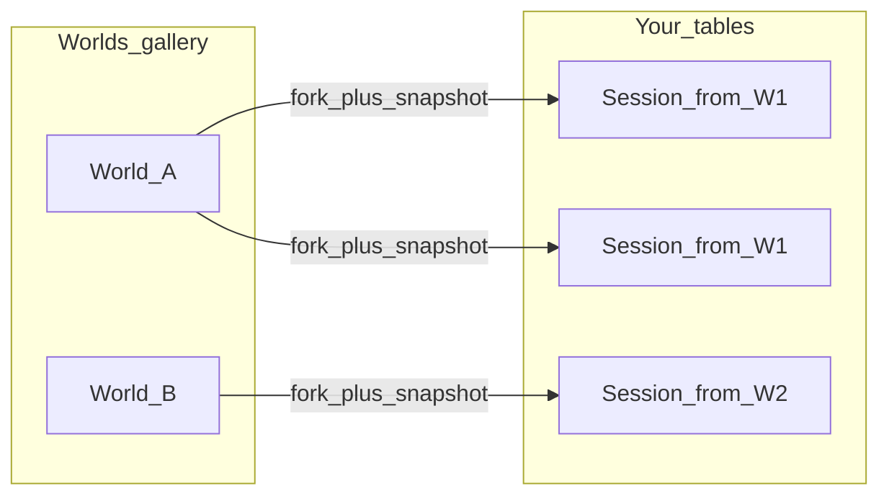
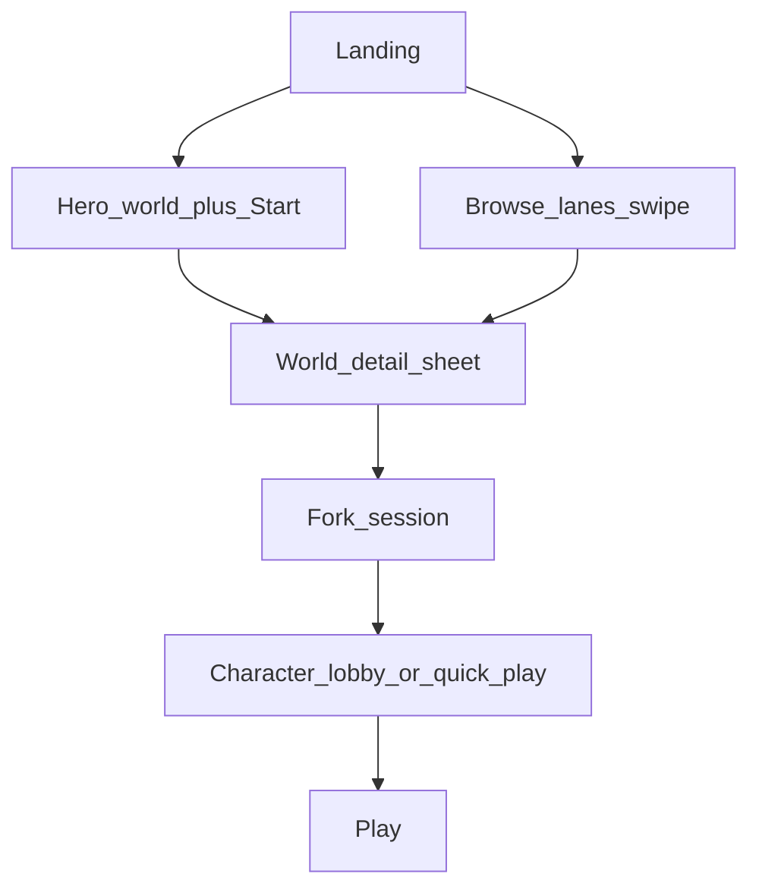
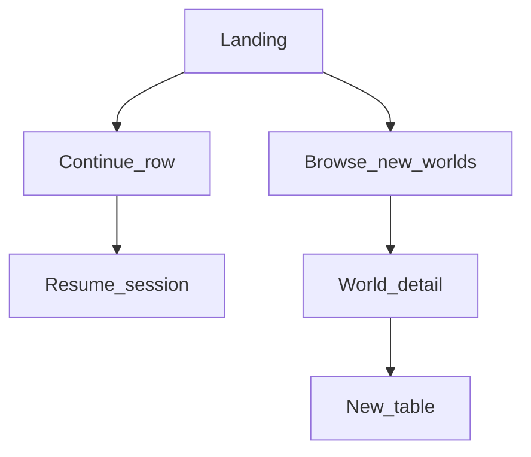
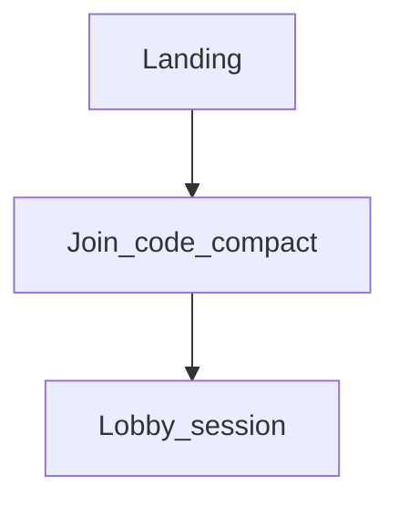

# Worlds & gallery — ecosystem vision (playdndai.com)

**Status:** Canonical **product + platform** reference for the **main game** first impression  
**Audience:** Product, design, engineering, video / narrative briefs  
**Scope:** This document is **only** the **worlds gallery** and what it implies for the **ecosystem** — how people land on **playdndai.com**, see **multiple worlds**, pick one, enter with a character, invite friends, and play. It is **not** a grab-bag of unrelated features.

**Parallel work (out of scope here):** Per-user “hide from my list” / My Adventures hygiene is tracked in [`PHASE_A_ADVENTURE_LIBRARY_HYGIENE.md`](./PHASE_A_ADVENTURE_LIBRARY_HYGIENE.md). That work runs **in parallel**; do not conflate it with this doc.

**Raw research dump:** [`WORLDS_GALLERY_RESEARCH_NOTES.md`](./WORLDS_GALLERY_RESEARCH_NOTES.md).

---

## Executive synthesis — best path forward (distilled)

This section reconciles [`TEMPLATES_AND_CATALOG.md`](./TEMPLATES_AND_CATALOG.md) §3 with [`WORLDS_GALLERY_RESEARCH_NOTES.md`](./WORLDS_GALLERY_RESEARCH_NOTES.md) (competitive scan + **playromana vs playdndai** split).

### Recommended product architecture: two speeds, one story

| Lane | Job | User feels |
|------|-----|------------|
| **Instant** (playromana.com *or* `playdndai.com/play` — see SEO below) | **10-second wow**: tap → in-session → narration/social beat → invite | “I’m already playing.” |
| **Depth** (playdndai.com home / worlds) | **Choose world**, character, table, retention | “This is where I live.” |

**Why this beats a single generic home:** One screen cannot optimize for both **impulse** (TikTok/Among Us bar) and **catalog depth** (Netflix/Steam) without compromise. Splitting **intent** matches how sticky products work: **Fortnite** (jump in vs locker), **Spotify** (play vs library), **Netflix** (hero play vs browse — but you are not a passive stream; you need a table).

**playdndai first screen (refined):** Prioritize **Continue** (if any) → **Browse worlds** → **Join with code** → **hero world** → **lanes**. Treat **“Quick start”** as **belonging to the instant lane** (Romana or `/play`), **not** as a competing primary CTA on the worlds home — otherwise you duplicate jobs and blur positioning.

### SEO & marketing: two domains vs one domain

**Two apex domains** (playromana.com + playdndai.com) **can** work for marketing: separate ad creatives (“try in 10s” vs “pick your world”), cleaner analytics, and a **shareable** instant URL that does not look like “settings.” **Downside:** domain authority splits, users may not understand the relationship, and you must **bridge** every exit from Romana → DnD AI (“More worlds”, “Customize”, “Host a table”) or you leak retention.

**Often stronger for SEO long-term:** **One primary domain** (e.g. playdndai.com) with **dedicated paths**: `/` or `/worlds` = catalog + identity; `/play` or `/romana` = instant funnel. Same two-speed **product**, **consolidated** backlinks and brand recall. Romana can still be a **named mode** in copy (“Romana room”) without a separate registrar if you prefer.

**Best-of-both compromise:** **Market** “Romana” as a **named product moment** (campaigns, video, streamers) while **canonical URLs** live under one site + path; only spin a second domain if a campaign **proves** you need a naked short link and you accept the SEO tradeoff.

### Case for **playromana.com** as its own site (wedge you already shipped)

When **playromana.com** is already the **instant** experience, keeping it on its **own domain** is a valid **go-to-market** choice, not a mistake:

- **One sentence hook** — “Jump in and play a Rome-flavored story with friends” is **easier to film, tweet, and rank for** than “AI tabletop that does everything.” Lower cognitive load = higher share rate for cold audiences.
- **Content flywheel** — A **narrow topical wedge** (Rome, aesthetics, accents, history-meme hooks) gives algorithms and SEO a **clear entity** to latch onto. **playdndai.com** then needs **many** world-specific pages and clips to compete for the same clarity; Romana concentrates that effort in **one** brand shape.
- **Bridge is the product glue** — Traffic that lands on Romana must **always** see a credible path to **more worlds / full platform** on playdndai.com so the wedge does not cap lifetime value.

**Tension (founder truth):** The **full** game—open genre, any adventure, depth of systems—is **more exciting to build and to demo in depth**. That is not an argument **against** the wedge; it is an argument for **where** each story is told:

| Surface | What you emphasize |
|---------|-------------------|
| **playromana.com** | Speed, social fun, Rome flavor, “holy shit we’re already playing.” |
| **playdndai.com + long-form** | Breadth, human DM, any world, serious RPG table — **after** the hook or for intentional seekers. |

Selling “everything” first is **hard**; selling “this one epic thing with friends” first is **easy**. The **everything** pitch belongs on the **main** property and in **bridged** moments, not on the first tap of the wedge.

### UX / UI (what it should look like in practice)

- **Instant lane (mobile-first):** Minimal chrome; one **Start**; optional tone/template **only if** it does not block the first beat; **invite** surfaced early; after the hook, **one** soft upsell row: “Explore all worlds on playdndai.”
- **Worlds home (mobile-first):** **No** wall of tiles above the fold; **short stack** + **horizontal lanes**; **Human DM / AI DM** as **filters or badges**, not a wall of mode choices; **Join** always visible; **world detail** = bottom sheet → fork → lobby.
- **Desktop:** Same IA; **wider hero** + **two columns** (value prop + featured world) optional; more lanes visible without scrolling.

### Stickiness, talkability, and content

| Lever | Mechanism |
|-------|-----------|
| **Retention** | **Continue** row + notifications tied to **your table** and **your world**; Romana creates the habit, DnD AI creates the **reason to return**. |
| **Sharing** | **End-of-beat** or **end-of-session** share cards (image + one line + deep link to **world** or **invite**); streamer-friendly **short path** on instant lane. |
| **UGC / clips** | Worlds as **named entities** (“We ran **Senate Intrigue**”) so clips have a **title** to search; later: public recap links (roadmap-aligned). |
| **KPIs** | Instant: time-to-first-narration, invite sent, return within 24h. Depth: world fork rate, Continue taps, sessions per user, share clicks. |

### Risks to manage

- **Cold traffic lands only on playdndai** — keep **one** featured world + fast fork path so SEO visitors are not punished.
- **Romana is weak** — the whole split collapses; instant lane must ship **first** or stay ruthlessly simple.
- **Two domains without bridge** — users treat Romana as a toy and never discover worlds.

### Conclusion

The **best scenario** is **not** “pick Netflix OR pick grid.” It is **dual entry, single narrative**: **insanely fast first session** (Romana or `/play`) + **rich worlds home** (playdndai) for **choice, identity, and return**. **SEO:** one domain + paths is simpler for authority; **two apex domains** (playromana.com + playdndai.com) is justified when the **Rome wedge** is your primary content/algorithm strategy—then **invest in bridge + breadth** on playdndai so the wedge does not undersell the full game. Update §3.1 to **drop duplicate “Quick start”** on the worlds home when the instant lane lives on Romana.

---

## 1. What this is (no understatement)

This is **not** “a catalog feature.” It is the **default mental model** for the product:

- **Netflix:** you open the app and see **many titles**; you **choose a movie** and watch **your** viewing session.
- **AI dungeon / story games:** you open the app and see **many stories**; you **pick one** and play **your** run.
- **playdndai.com (main game):** you land and see **many worlds**; you **pick a world**, **bring your character**, **bring friends**, and **play your table’s instance** of that world.

Each **world** (internally: a template / catalog definition) is **one row in the gallery**. Each **playthrough** is a **separate `session`** forked from that world’s definition so creators, hosts, and other tables never share one fragile row.

---

## 2. Core metaphor: World → Enter → Table

| Concept | Meaning |
|---------|---------|
| **World** | The **published** thing in the gallery: premise, structure, art, tags, stats surface. One **canonical definition** the platform (later: creators) maintains. |
| **Enter / Play** | Creates a **new instance** (`session`) with a **frozen snapshot** of that world at that moment (revision / JSON). Your group’s state lives here — not on the gallery card. |
| **Character** | Players use **their** character (or create one) **into** that instance — same idea as taking your seat into one screening, not mutating the movie file. |
| **Friends** | Multiplayer is **this instance**; invite codes / party size are **table** concerns, not gallery concerns. |



---

## 3. Arrival & user flow (UX — mobile-first, desktop-aligned)

Design principle: **thumb zone and one-hand use define mobile**; **wider canvas adds density and parallel columns**, not a different product. Same **information architecture** on both.

### 3.1 What they see first (recommendation)

**Do not** open with a dense wall of every world “in your face” on first visit. On a phone that reads as noise and raises cognitive load before trust exists.

**Do** open with a **short stack** (top → bottom):

1. **Brand + one-line promise** — e.g. what makes playdndai.com different (multiplayer table + AI/human DM + curated worlds). One breath, not a manifesto.
2. **Primary CTA strip (mode / intent)** — compact **chips or icon row** (see §3.3): *Browse worlds*, *Join with code*, and (if the **instant lane** is not on this URL) a single *Try now*; when Romana or `/play` owns instant play, **omit** duplicate quick-start here. Optional *Human DM* / *AI DM* as **filters or paths**, not five equal heroes.
3. **Hero lane** — **one** featured world (large card or cinematic strip) + secondary *Start* — gives a **default “watch this movie”** path like Netflix above the fold.
4. **Continue** (if authenticated and has active/recent tables) — horizontal scroll row; empty state skipped for cold users.
5. **Curated lanes** — *Staff picks*, *Under 30 min*, *Play with friends*, etc. — **horizontal carousels** on mobile; more lanes visible at once on desktop.

Then **Browse all** / search / categories as a **dedicated affordance** (tab, full-bleed list, or bottom nav item) so power users and SEO landings can go deep without forcing every cold user through 40 cards.

**Summary:** First screen = **orientation + one hero world + start of discovery**, not the entire catalog.

### 3.2 “Worlds first” vs “mode icons first” — hybrid IA

You do not have to choose only one.

| Approach | Role on playdndai.com |
|----------|------------------------|
| **Mode as entry (Human DM / AI DM)** | Answers “**how** is the table run?” — technical distinction players care about **after** they want to play. Good as **filters**, **badges on world cards**, or a **second step** when starting from scratch, not as the only headline above curated worlds. |
| **Curated worlds first** | Answers “**what** are we playing?” — matches Netflix / story-picker competitors and your **ecosystem** positioning. This should **dominate** the first scroll. |
| **Join with code / host table** | Power path — **always visible** but **secondary** (top bar, icon, or compact row) so returning hosts are not blocked. |

**Recommended hybrid:** **Worlds-forward** landing + **small “How we play”** row (AI DM · Human DM · Learn in 3 min) that either **filters** the gallery or opens **explainer sheets** — cute icons are welcome if they **reduce** choice paralysis, not **multiply** primary CTAs.

### 3.3 Example flows (happy paths)

**Cold visitor (anonymous or new account)**



**Returning player**



**Friend with code**



### 3.4 Mobile vs desktop — same spine, different layout

| Element | Mobile | Desktop |
|---------|--------|---------|
| **Hero** | Full-width card, 16:9 or tall poster | Optional **two-column**: hero world left, short value prop + CTAs right |
| **Lanes** | Single column of **horizontal carousels** (Netflix pattern) | Same carousels + optional **second column** of filters or “Start something new” |
| **Navigation** | Sticky **top bar** (logo, join, profile) + optional **bottom** for Browse / Home / You | Top bar only; more links inline |
| **World detail** | **Bottom sheet** or full-screen step before fork | **Side panel** or modal alongside gallery |
| **Touch** | Large tap targets, swipe between cards in a lane | Hover states, keyboard focus |

Ashveil already uses **Liquid Obsidian**, `min-h-dvh`, and chip patterns — extend those rather than inventing a separate “desktop brand.”

### 3.5 Competitive patterns (desk research snapshot)

Story-forward AI products tend to combine: **quick start or featured scenario**, **genre/world browse**, **community or curated lists**, then **character / party** before the loop. Examples called out in market blurbs: **hub + curated scenarios** (e.g. Paladinia-style), **genre then character** (e.g. AI Game Master-style), **discover tab for shared adventures** (AI Dungeon ecosystem). None of that replaces your differentiator: **real multiplayer table + optional human DM** — surface that in copy and in **badges**, not only as a buried setting.

### 3.6 UX decisions to lock in design

- Is **Human DM** a **global session mode** chosen before world, or a **per-world** availability flag?
- Does **Quick start** always map to **one** pinned world, or rotate?
- **Anonymous play** depth: browse all worlds vs featured-only until sign-in?
- **Party games** (Jackbox-style): same home as **lanes** or separate tab from day one?

---

## 4. Gallery depth (later — same ecosystem)

The gallery is also where **discovery and reputation** live. Plan for **metrics on each world card** and **within categories**:

| Signal (evolution) | Purpose |
|--------------------|---------|
| **Play count** | How many **instances** (or completed runs) started from this world — trust + trending. |
| **Likes / favorites** | Lightweight quality signal; optional account-gated. |
| **Ranking within category** | Worlds grouped into **categories** (genre, tone, length, “cozy”, “horror”, etc. — names TBD); sort or badge *Top this week* inside a lane. |
| **Creator / curated badge** | Platform vs community vs verified — when UGC exists. |

These require **analytics + storage** wired to **fork events**, not to “one global campaign row.” Design APIs and privacy (aggregates vs public) when implementing.

---

## 5. Naming: “World” vs engineering terms

| User-facing | Engineering (today / near future) |
|-------------|-----------------------------------|
| **World** | Catalog row: title, description, cover, category, publish state, optional `module_key` / seed payload / revision. |
| **Your table / run** | `sessions` + `players` + game state. |
| **`module_key` / seeds** | Implementation detail: static seeds (e.g. [`ROMA_SEEDS`](../src/lib/rome/seeder.ts)) today; migrate into **world rows** or slugs as the gallery ships. |

Avoid calling everything “template” in player-facing copy; **world** or **story** reads closer to Netflix / story-picker competitors.

**Party mode:** This doc focuses on the **main game** worlds gallery. Party packs (`party_config.template_key`, [`party-templates.ts`](../src/lib/party/party-templates.ts)) can appear as **another lane** or a **separate tab** later; they are not the subject of this vision doc unless product merges them into one browse.

---

## 6. Platform rules (creator & player trust)

- **Unpublish / delist** — Stops **new** forks only. **Running tables** keep their **snapshot** so players are not kicked by a gallery change.
- **Edit world** — New revision; **new** sessions use the new revision; old sessions stay on old snapshot unless you explicitly build “migrate table” (usually avoid for v1).
- **100 groups playing the same world** — **100 sessions**, not one shared row. Host A hiding something from **their** list must not affect Host B (personal list hygiene is the parallel doc above).

---

## 7. Alignment with existing specs (background)

| Document | Why it matters |
|----------|----------------|
| [ASHVEIL_SPEC.md](./ASHVEIL_SPEC.md) | `campaign_mode` + `module` + `module_key` — today’s **structured story** path becomes **world definitions** in the gallery. |
| [PRODUCTION_ROADMAP.md](../PRODUCTION_ROADMAP.md) | Phases 16–18–19 — tutorial CTA, marketing vs game shell, history — **lanes** and **Continue** plug into the same landing story. |
| [SESSION_UI_VIEW_MODES_SPEC.md](./SESSION_UI_VIEW_MODES_SPEC.md) | **Inside** a session UI; **orthogonal** to the gallery chrome. |

---

## 8. Implementation epic checklist (worlds & gallery — when you build it)

**Phased build plan (bottom → top, invariants, acceptance per phase):** [`WORLDS_CATALOG_IMPLEMENTATION_PHASES.md`](./WORLDS_CATALOG_IMPLEMENTATION_PHASES.md) — **give this file to the implementing agent** so execution stays grounded and non-breaking.

Use the checklist below as a **high-level** mirror of that doc (not library hygiene).

- [ ] **Schema:** `worlds` / `catalog_items` (or equivalent) + revisions; `sessions` gains `world_id`, `world_revision`, `world_snapshot` (JSON) set at fork.
- [ ] **API:** Public list (published worlds); authenticated fork; optional admin publish/unpublish.
- [ ] **Landing / home:** Netflix-style layout for playdndai.com main game; featured row + lanes; mobile-first horizontal scroll where needed.
- [ ] **Fork:** Immutable snapshot on create; tests for unpublish + active session.
- [ ] **Metrics (phase 2):** play counts, likes, category rankings — event pipeline from fork / complete / rate.
- [ ] **Seed migration:** Map existing authored modules (e.g. Roma keys) into first world rows so the gallery is non-empty on launch.
- [ ] **Video / marketing:** One narrative: “multiple worlds, pick one, play with friends” — this doc is the brief.
- [ ] **UX:** Prototype §3 flows at **mobile width first**; desktop breakpoint adds columns, not new routes.

---

## 9. Appendix — deep research prompt (ChatGPT, Perplexity, Claude, etc.)

Paste the block below into your research tool when you want **competitive citations** or a **second opinion** beyond §3.

```text
You are a senior product designer + UX researcher specializing in mobile-first game and entertainment apps.

Context: We are designing the FIRST screen and discovery flow for playdndai.com — a multiplayer AI-powered tabletop-style game where users pick a “world” (curated story template), create or bring a character, invite friends, and play at a shared table. Optional Human DM vs AI DM. We want a Netflix-style “many worlds to enter” ecosystem, not a single linear tutorial only.

Tasks:
1) Analyze first-screen and onboarding patterns for: Netflix, Spotify, Apple Arcade / App Store Games, Steam store (desktop), AI Dungeon, Character.AI group features, and any top “AI RPG / AI game master” mobile apps (2024–2026). For each, note: information hierarchy above the fold, number of primary CTAs, how they balance “browse catalog” vs “resume / continue” vs “quick start.”
2) Recommend a default layout for MOBILE (320–430px wide) vs DESKTOP for our product: should the first screen be a full world grid, a hero + lanes, or a mode chooser (Human DM / AI DM / curated worlds)? Argue tradeoffs for cognitive load and conversion.
3) Propose 2–3 alternative IA models (e.g. worlds-first vs mode-first vs hybrid) with wireframe-level bullet lists (sections top to bottom).
4) List anti-patterns for mobile discovery (especially for narrative / RPG products).
5) Cite or link to specific articles, app store pages, or UX teardowns where possible.

Output: structured report with headings; finish with a single recommended MVP first screen for our positioning.
```

---

## 10. Document history

- **2026-04:** Refocused on **worlds + Netflix-style gallery + playdndai.com first impression**; removed Phase A/B framing; parallel hygiene out of scope.
- **2026-04:** Added **§3 arrival & user flow** (mobile-first, hybrid worlds/mode IA, mermaid flows, competitive snapshot) and **§9 appendix** research prompt.
- **2026-04:** Added **Executive synthesis** (dual entry, SEO one-domain vs two, stickiness/share loop); §3.1 CTA strip aligned with instant lane on Romana/`/play`.
- **2026-04:** Added **Case for playromana.com** (wedge SEO/content vs breadth on playdndai; founder tension framed).
- **2026-04:** Linked **§8** → [`WORLDS_CATALOG_IMPLEMENTATION_PHASES.md`](./WORLDS_CATALOG_IMPLEMENTATION_PHASES.md) (agent-ready phased implementation).
